Armour resists melee. Magic armour resists spells.

## Bracken Fenmite

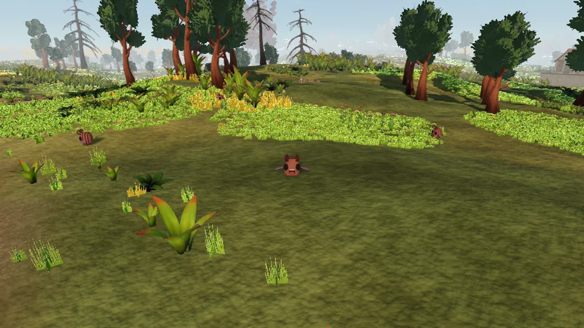

| Tier | Health | Max hit | Attack speed | Armour | Magic armour | Behaviour | Aggro |
| --- | --- | --- | --- | --- | --- | --- | --- |
| 1 | 4 | 1 | 1.2 s | 0 | 0 | passive | 4 m |

### Drops

| Drop | Quantity | Chance |
| --- | --- | --- |
| Marks | 3-11 | Always |
| [Bittergrain Seed](./items/#bittergrain-seed) | 1-2 | 30% |
| [Duskberry Seed](./items/#duskberry-seed) | 1 | 12% |
| [Pale Quartz](./items/#pale-quartz) | 1 | 4% |

## March Road Reaver

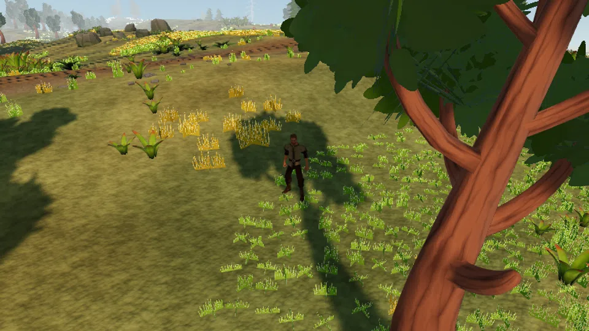

| Tier | Health | Max hit | Attack speed | Armour | Magic armour | Behaviour | Aggro |
| --- | --- | --- | --- | --- | --- | --- | --- |
| 1 | 9 | 3 | 2.4 s | 10 | 10 | aggressive | 14 m |

### Drops

| Drop | Quantity | Chance |
| --- | --- | --- |
| Marks | 7-27 | Always |
| [Coarse Hide](./items/#coarse-hide) | 1-2 | 35% |
| [Grithe Ore](./items/#grithe-ore) | 1-2 | 25% |
| [Essence Shard](./items/#essence-shard) | 1 | 10% |
| [Grithe Helm](./items/#grithe-helm) | 1 | 3% |

## Marchwolf Pup

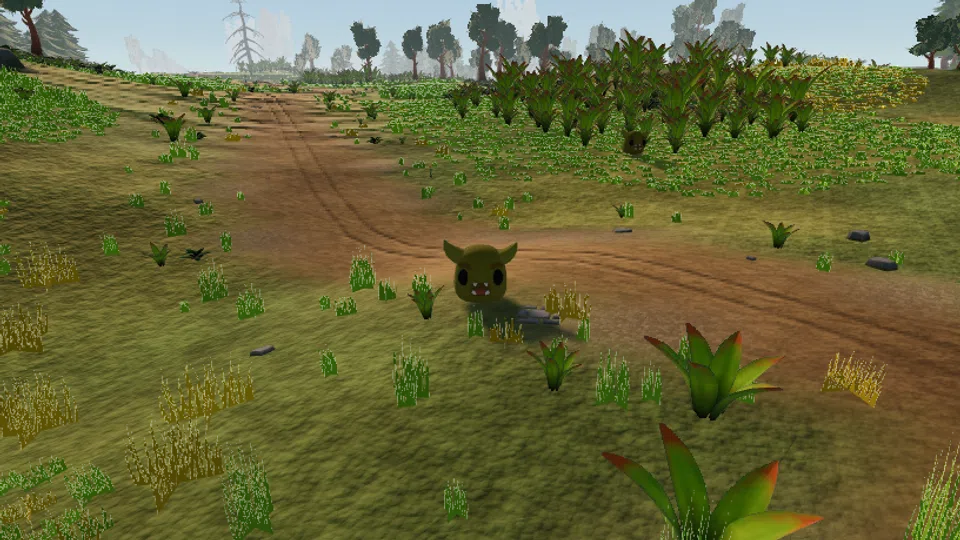

| Tier | Health | Max hit | Attack speed | Armour | Magic armour | Behaviour | Aggro |
| --- | --- | --- | --- | --- | --- | --- | --- |
| 1 | 12 | 3 | 2.4 s | 4 | 2 | aggressive | 8 m |

### Drops

| Drop | Quantity | Chance |
| --- | --- | --- |
| Marks | 3-11 | Always |
| [Coarse Hide](./items/#coarse-hide) | 1-2 | 60% |
| [Grithe Ore](./items/#grithe-ore) | 1-2 | 20% |
| [Grithe Dagger](./items/#grithe-dagger) | 1 | 2% |

## Palewood Hollow

| Tier | Health | Max hit | Attack speed | Armour | Magic armour | Behaviour | Aggro |
| --- | --- | --- | --- | --- | --- | --- | --- |
| 1 | 9 | 5 | 3.0 s | 0 | 20 | territorial | 7 m |

### Drops

| Drop | Quantity | Chance |
| --- | --- | --- |
| Marks | 3-11 | Always |
| [Palewood Log](./items/#palewood-log) | 1-2 | 30% |
| [Pale Quartz](./items/#pale-quartz) | 1 | 20% |
| [Essence Shard](./items/#essence-shard) | 1 | 8% |

## Redsill Mudback

| Tier | Health | Max hit | Attack speed | Armour | Magic armour | Behaviour | Aggro |
| --- | --- | --- | --- | --- | --- | --- | --- |
| 1 | 16 | 5 | 3.6 s | 35 | 0 | territorial | 5 m |

### Drops

| Drop | Quantity | Chance |
| --- | --- | --- |
| Marks | 3-11 | Always |
| [March Stone](./items/#march-stone) | 2-4 | 65% |
| [Grithe Ore](./items/#grithe-ore) | 1-2 | 30% |
| [Pale Quartz](./items/#pale-quartz) | 1 | 10% |

## Rill Skitterling

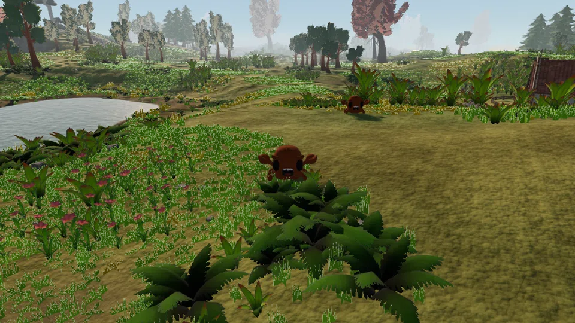

| Tier | Health | Max hit | Attack speed | Armour | Magic armour | Behaviour | Aggro |
| --- | --- | --- | --- | --- | --- | --- | --- |
| 1 | 6 | 2 | 2.4 s | 0 | 0 | passive | 6 m |

### Drops

| Drop | Quantity | Chance |
| --- | --- | --- |
| Marks | 3-11 | Always |
| [March Stone](./items/#march-stone) | 1-2 | 35% |
| [Coarse Hide](./items/#coarse-hide) | 1 | 20% |
| [Pale Quartz](./items/#pale-quartz) | 1 | 6% |

## Bramble Skitterling

| Tier | Health | Max hit | Attack speed | Armour | Magic armour | Behaviour | Aggro |
| --- | --- | --- | --- | --- | --- | --- | --- |
| 5 | 22 | 4 | 2.4 s | 18 | 55 | aggressive | 7 m |

### Drops

| Drop | Quantity | Chance |
| --- | --- | --- |
| Marks | 15-55 | Always |
| [Corven Ore](./items/#corven-ore) | 1-2 | 35% |
| [Bramble Hide](./items/#bramble-hide) | 1 | 30% |
| [Vell Amber](./items/#vell-amber) | 1 | 7% |

## Canopy Hollow

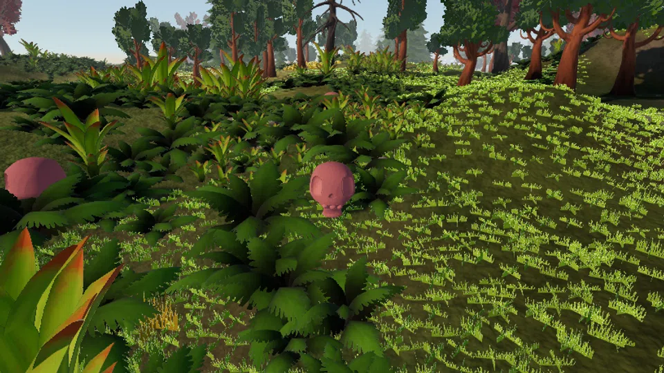

| Tier | Health | Max hit | Attack speed | Armour | Magic armour | Behaviour | Aggro |
| --- | --- | --- | --- | --- | --- | --- | --- |
| 5 | 24 | 8 | 3.0 s | 6 | 40 | territorial | 8 m |

### Drops

| Drop | Quantity | Chance |
| --- | --- | --- |
| Marks | 15-55 | Always |
| [Duskoak Log](./items/#duskoak-log) | 1-2 | 30% |
| [Vell Amber](./items/#vell-amber) | 1 | 15% |
| [Essence Shard](./items/#essence-shard) | 1-2 | 12% |
| [Amber Focus](./items/#amber-focus) | 1 | 2% |

## Gorge Reaver

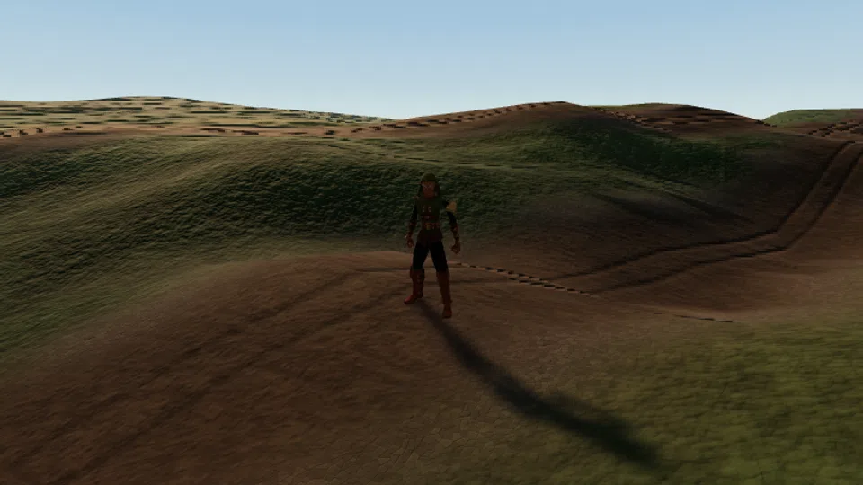

| Tier | Health | Max hit | Attack speed | Armour | Magic armour | Behaviour | Aggro |
| --- | --- | --- | --- | --- | --- | --- | --- |
| 5 | 26 | 6 | 2.4 s | 26 | 24 | aggressive | 14 m |

### Drops

| Drop | Quantity | Chance |
| --- | --- | --- |
| Marks | 35-135 | Always |
| [Bramble Hide](./items/#bramble-hide) | 1-2 | 35% |
| [Corven Ore](./items/#corven-ore) | 1-2 | 25% |
| [Essence Shard](./items/#essence-shard) | 1-2 | 15% |
| [Corven Boots](./items/#corven-boots) | 1 | 3% |

## Marchwolf

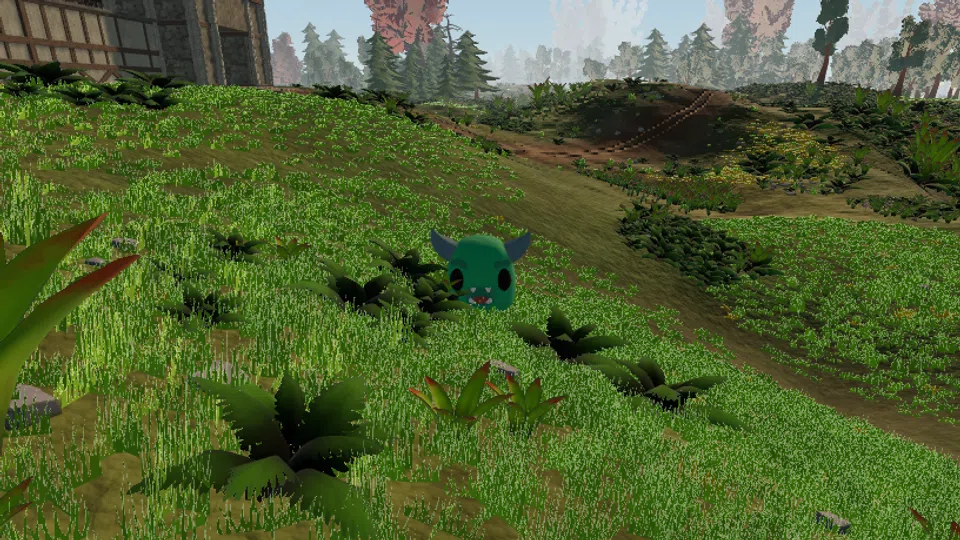

| Tier | Health | Max hit | Attack speed | Armour | Magic armour | Behaviour | Aggro |
| --- | --- | --- | --- | --- | --- | --- | --- |
| 5 | 28 | 6 | 2.4 s | 14 | 8 | aggressive | 10 m |

### Drops

| Drop | Quantity | Chance |
| --- | --- | --- |
| Marks | 15-55 | Always |
| [Bramble Hide](./items/#bramble-hide) | 1-2 | 55% |
| [Bramble Trout](./items/#bramble-trout) | 1-2 | 25% |
| [Corven Dagger](./items/#corven-dagger) | 1 | 2% |

## Mire Fenmite

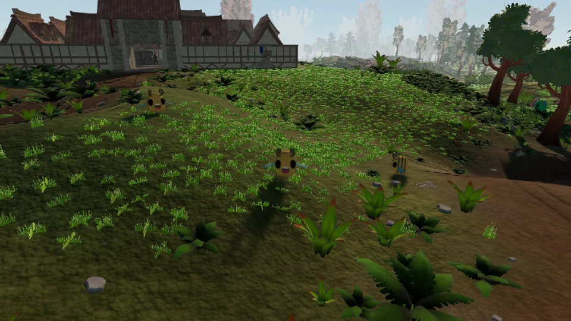

| Tier | Health | Max hit | Attack speed | Armour | Magic armour | Behaviour | Aggro |
| --- | --- | --- | --- | --- | --- | --- | --- |
| 5 | 12 | 3 | 1.2 s | 8 | 8 | passive | 5 m |

### Drops

| Drop | Quantity | Chance |
| --- | --- | --- |
| Marks | 15-55 | Always |
| [Duskberry Seed](./items/#duskberry-seed) | 1-2 | 28% |
| [Bramble Hide](./items/#bramble-hide) | 1 | 15% |
| [Vell Amber](./items/#vell-amber) | 1 | 6% |

## Thornbound Husk

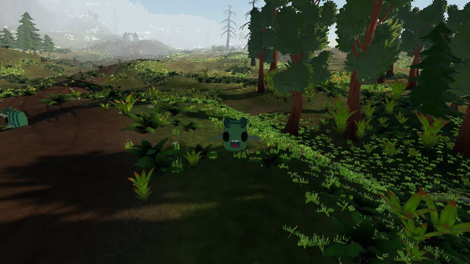

| Tier | Health | Max hit | Attack speed | Armour | Magic armour | Behaviour | Aggro |
| --- | --- | --- | --- | --- | --- | --- | --- |
| 5 | 26 | 5 | 2.4 s | 10 | 45 | territorial | 9 m |

### Drops

| Drop | Quantity | Chance |
| --- | --- | --- |
| Marks | 15-55 | Always |
| [Duskoak Log](./items/#duskoak-log) | 1-3 | 40% |
| [Bramble Hide](./items/#bramble-hide) | 1 | 35% |
| [Vell Amber](./items/#vell-amber) | 1 | 8% |
| [Corven Helm](./items/#corven-helm) | 1 | 2% |

## Cairnwight

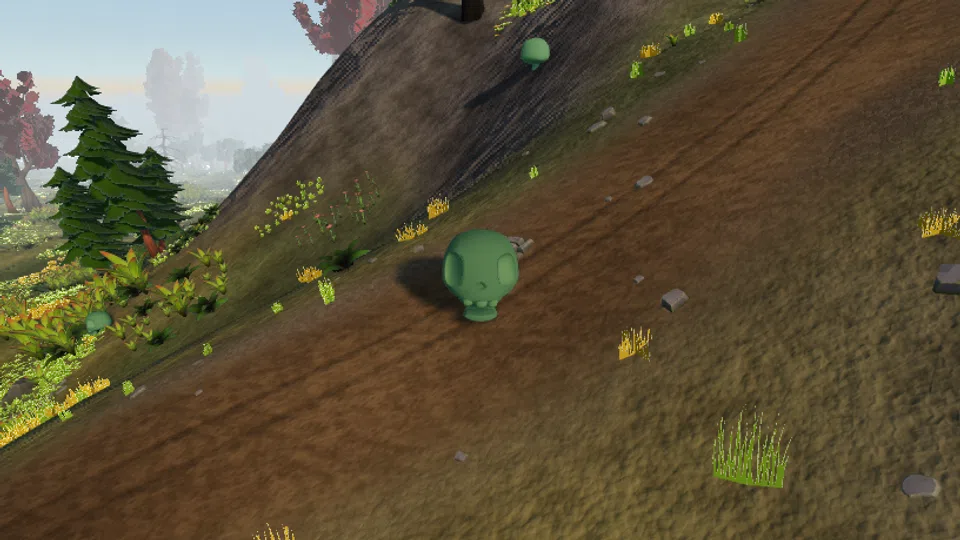

| Tier | Health | Max hit | Attack speed | Armour | Magic armour | Behaviour | Aggro |
| --- | --- | --- | --- | --- | --- | --- | --- |
| 10 | 38 | 7 | 2.4 s | 55 | 10 | aggressive | 10 m |

### Drops

| Drop | Quantity | Chance |
| --- | --- | --- |
| Marks | 30-110 | Always |
| [Wight Shroud](./items/#wight-shroud) | 1 | 40% |
| [Kaldite Ore](./items/#kaldite-ore) | 1-2 | 30% |
| [Cairn Garnet](./items/#cairn-garnet) | 1 | 10% |
| [Kaldite Boots](./items/#kaldite-boots) | 1 | 2% |

## Karrow Reaver

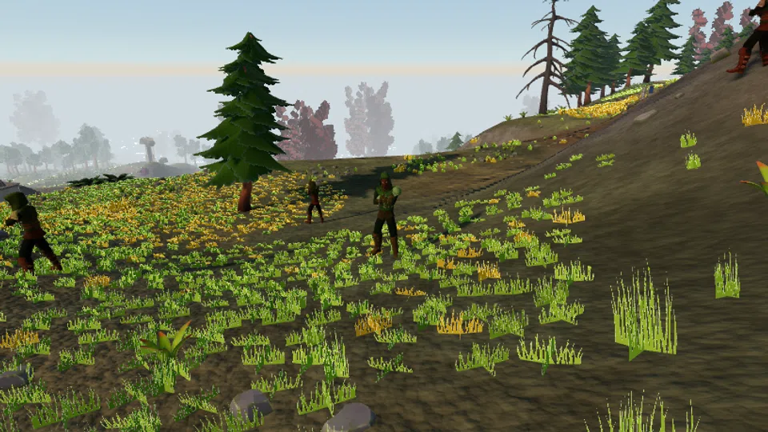

| Tier | Health | Max hit | Attack speed | Armour | Magic armour | Behaviour | Aggro |
| --- | --- | --- | --- | --- | --- | --- | --- |
| 10 | 40 | 7 | 2.4 s | 42 | 40 | aggressive | 14 m |

### Drops

| Drop | Quantity | Chance |
| --- | --- | --- |
| Marks | 70-270 | Always |
| [Wight Shroud](./items/#wight-shroud) | 1 | 30% |
| [Kaldite Ore](./items/#kaldite-ore) | 1-3 | 30% |
| [Essence Shard](./items/#essence-shard) | 1-3 | 20% |
| [Kaldite Dagger](./items/#kaldite-dagger) | 1 | 3% |

## Ordrun the Quarrykeeper

| Tier | Health | Max hit | Attack speed | Armour | Magic armour | Behaviour | Aggro |
| --- | --- | --- | --- | --- | --- | --- | --- |
| 10 | 200 | 12 | 3.0 s | 62 | 18 | territorial | 24 m |

### Drops

| Drop | Quantity | Chance |
| --- | --- | --- |
| Marks | 900-1400 | Always |
| [Kaldite Sword](./items/#kaldite-sword) | 1 | 100% |
| [Kaldite Bar](./items/#kaldite-bar) | 3-6 | 100% |
| [Cairn Garnet](./items/#cairn-garnet) | 2-4 | 100% |
| [Wight Shroud](./items/#wight-shroud) | 1-2 | 75% |

## Scree Skitterling

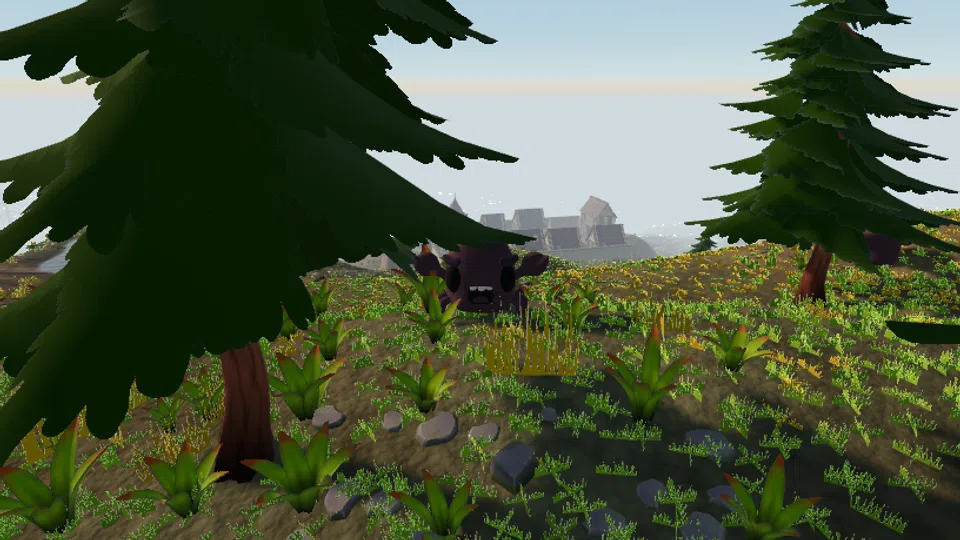

| Tier | Health | Max hit | Attack speed | Armour | Magic armour | Behaviour | Aggro |
| --- | --- | --- | --- | --- | --- | --- | --- |
| 10 | 34 | 6 | 2.4 s | 30 | 115 | aggressive | 8 m |

### Drops

| Drop | Quantity | Chance |
| --- | --- | --- |
| Marks | 30-110 | Always |
| [Kaldite Ore](./items/#kaldite-ore) | 1-3 | 45% |
| [March Stone](./items/#march-stone) | 2-4 | 30% |
| [Cairn Garnet](./items/#cairn-garnet) | 1 | 8% |

## Tarn Marchwolf

| Tier | Health | Max hit | Attack speed | Armour | Magic armour | Behaviour | Aggro |
| --- | --- | --- | --- | --- | --- | --- | --- |
| 10 | 30 | 7 | 1.8 s | 20 | 12 | aggressive | 12 m |

### Drops

| Drop | Quantity | Chance |
| --- | --- | --- |
| Marks | 30-110 | Always |
| [Bramble Hide](./items/#bramble-hide) | 1-2 | 40% |
| [Cragfin](./items/#cragfin) | 1-2 | 30% |
| [Coarse Hide](./items/#coarse-hide) | 1-2 | 25% |
| [Cairn Garnet](./items/#cairn-garnet) | 1 | 6% |

## Terrace Mudback

| Tier | Health | Max hit | Attack speed | Armour | Magic armour | Behaviour | Aggro |
| --- | --- | --- | --- | --- | --- | --- | --- |
| 10 | 46 | 11 | 3.6 s | 78 | 0 | territorial | 6 m |

### Drops

| Drop | Quantity | Chance |
| --- | --- | --- |
| Marks | 30-110 | Always |
| [Kaldite Ore](./items/#kaldite-ore) | 2-4 | 55% |
| [March Stone](./items/#march-stone) | 2-5 | 35% |
| [Cairn Garnet](./items/#cairn-garnet) | 1 | 12% |

## Thornbound Elder

| Tier | Health | Max hit | Attack speed | Armour | Magic armour | Behaviour | Aggro |
| --- | --- | --- | --- | --- | --- | --- | --- |
| 10 | 44 | 8 | 3.0 s | 22 | 70 | territorial | 11 m |

### Drops

| Drop | Quantity | Chance |
| --- | --- | --- |
| Marks | 30-110 | Always |
| [Cairnpine Log](./items/#cairnpine-log) | 1-3 | 45% |
| [Wight Shroud](./items/#wight-shroud) | 1 | 35% |
| [Cairnleaf Seed](./items/#cairnleaf-seed) | 1-2 | 15% |
| [Cairn Garnet](./items/#cairn-garnet) | 1 | 12% |
| [Cairnpine Staff](./items/#cairnpine-staff) | 1 | 2% |
