| Item | Tier | Category | Stacks | Buy | Sell | Use |
| --- | --- | --- | --- | --- | --- | --- |
| 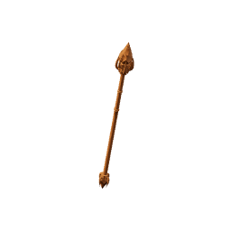 **Basic Wooden Staff** | 0 | equipment | No | 20 | 12 | mainHand; staff; 2-handed; 3.0 s cast cadence |
|  **Basic Wooden Wand** | 0 | equipment | No | 12 | 7 | mainHand; wand; 1-handed; 2.2 s cast cadence |
| 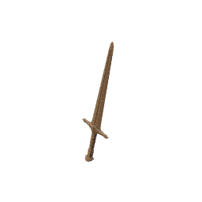 **Worn Shortsword** | 0 | equipment | No | 15 | 9 | mainHand |
|  **Worn Hatchet** | 0 | tool | No | 8 | 5 | Woodcutting +1 |
| 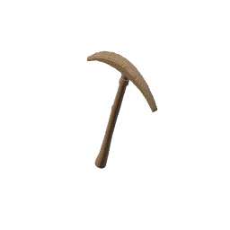 **Worn Pickaxe** | 0 | tool | No | 8 | 5 | Mining +1 |
| 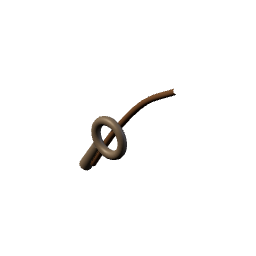 **Worn Rod** | 0 | tool | No | 6 | 4 | Fishing +1 |
| 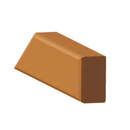 **Grithe Bar** | 1 | bar | No | 30 | 18 | - |
| 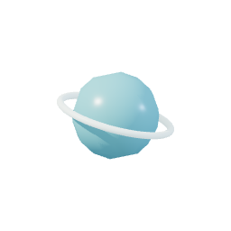 **Air Orb** | 1 | component | No | 0 | 0 | boss altar key; awakens its regional altar for 1000-charge weapons; released |
|  **Coarse Hide** | 1 | component | No | 16 | 10 | - |
| 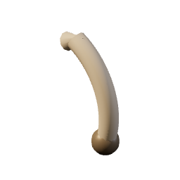 **Coney Foot** | 1 | component | Yes | 18 | 11 | - |
|  **Curled Horn** | 1 | component | No | 22 | 13 | - |
| 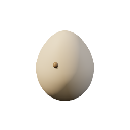 **Hen Egg** | 1 | component | Yes | 6 | 4 | - |
| 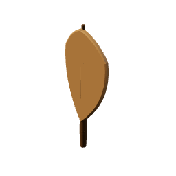 **Hen Feather** | 1 | component | Yes | 3 | 2 | - |
| 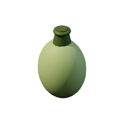 **Marsh Gland** | 1 | component | Yes | 15 | 9 | - |
|  **Ox Horn** | 1 | component | No | 26 | 16 | - |
| 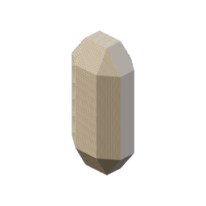 **Pale Quartz** | 1 | component | Yes | 20 | 12 | - |
| 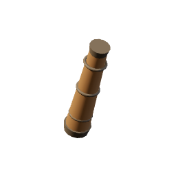 **Palewood Handle** | 1 | component | Yes | 6 | 4 | - |
| 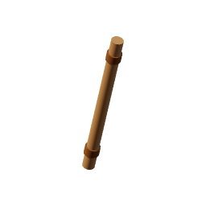 **Palewood Shaft** | 1 | component | Yes | 4 | 2 | - |
| 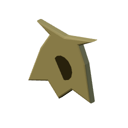 **Viper Skin** | 1 | component | No | 24 | 14 | - |
| 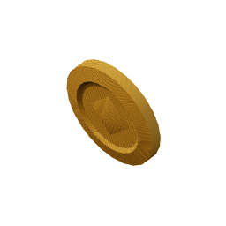 **Marks** | 1 | currency | Yes | 1 | 1 | - |
| 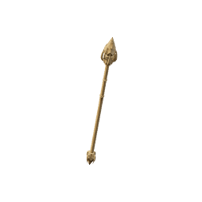 **Air Staff** | 1 | equipment | No | 140 | 84 | mainHand; staff; 2-handed; 3.0 s cast cadence; 1000 Air charges; Magic 1 |
|  **Air Wand** | 1 | equipment | No | 95 | 57 | mainHand; wand; 1-handed; 2.2 s cast cadence; 1000 Air charges; Magic 1 |
|  **Ember Charm** | 1 | equipment | No | 105 | 63 | accessory2; Magic 1 |
|  **Ember Ring** | 1 | equipment | No | 95 | 57 | accessory1; Magic 1 |
| 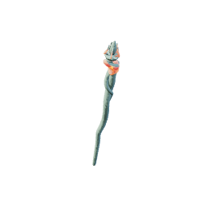 **Galeskin Staff** | 1 | equipment | No | 210 | 126 | mainHand; staff; 2-handed; 3.0 s cast cadence; Magic 1 |
| 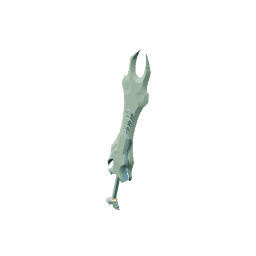 **Galeskin Sword** | 1 | equipment | No | 270 | 162 | mainHand; Melee 1 |
| 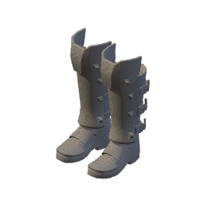 **Grithe Boots** | 1 | equipment | No | 80 | 48 | feet; Melee 1 |
| 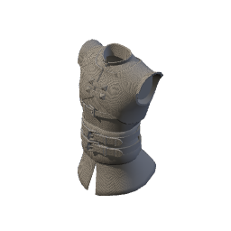 **Grithe Cuirass** | 1 | equipment | No | 220 | 132 | body; Melee 1 |
| 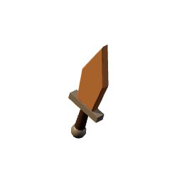 **Grithe Dagger** | 1 | equipment | No | 90 | 54 | mainHand; Melee 1 |
| 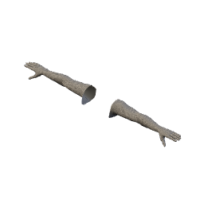 **Grithe Gloves** | 1 | equipment | No | 80 | 48 | hands; Melee 1 |
| 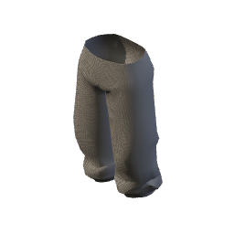 **Grithe Greaves** | 1 | equipment | No | 200 | 120 | legs; Melee 1 |
| 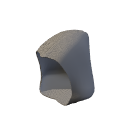 **Grithe Helm** | 1 | equipment | No | 110 | 66 | head; Melee 1 |
| 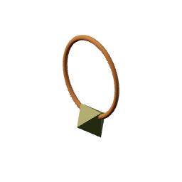 **Grithe Pendant** | 1 | equipment | No | 105 | 63 | accessory2; Melee 1 |
|  **Grithe Ring** | 1 | equipment | No | 95 | 57 | accessory1; Melee 1 |
| 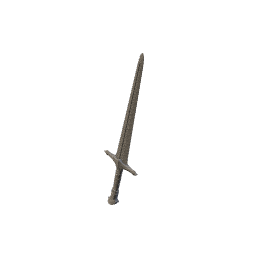 **Grithe Sword** | 1 | equipment | No | 180 | 108 | mainHand; Melee 1 |
|  **Marchhide Boots** | 1 | equipment | No | 65 | 39 | feet; Magic 1 |
| 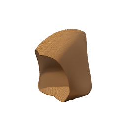 **Marchhide Hood** | 1 | equipment | No | 90 | 54 | head; Magic 1 |
|  **Marchhide Leggings** | 1 | equipment | No | 150 | 90 | legs; Magic 1 |
| 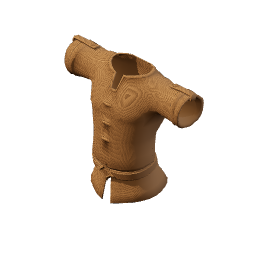 **Marchhide Robe** | 1 | equipment | No | 170 | 102 | body; Magic 1 |
|  **Marchhide Wraps** | 1 | equipment | No | 65 | 39 | hands; Magic 1 |
| 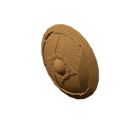 **Palewood Shield** | 1 | equipment | No | 70 | 42 | offHand; Melee 1 |
| 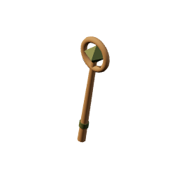 **Palewood Staff** | 1 | equipment | No | 140 | 84 | mainHand; staff; 2-handed; 3.0 s cast cadence; Magic 1 |
| 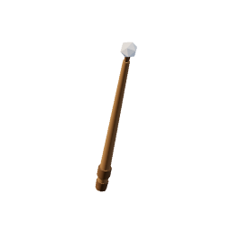 **Palewood Wand** | 1 | equipment | No | 95 | 57 | mainHand; wand; 1-handed; 2.2 s cast cadence; Magic 1 |
| 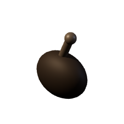 **Burnt Game** | 1 | food | No | 1 | 1 | - |
| 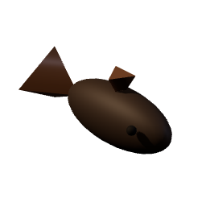 **Burnt Minnow** | 1 | food | No | 1 | 1 | - |
| 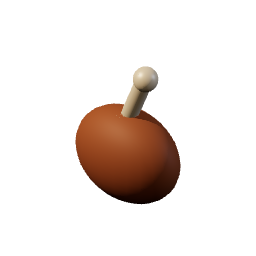 **Roast Game** | 1 | food | No | 24 | 14 | Heals 3 |
| 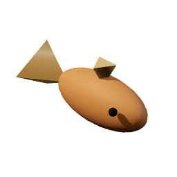 **Seared Minnow** | 1 | food | No | 22 | 13 | Heals 3 |
|  **Air Essence** | 1 | resource | Yes | 9 | 5 | - |
|  **Grithe Ore** | 1 | resource | No | 12 | 7 | - |
| 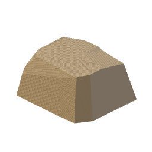 **March Stone** | 1 | resource | No | 5 | 3 | - |
| 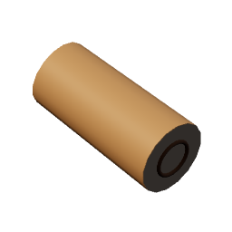 **Palewood Log** | 1 | resource | No | 10 | 6 | - |
| 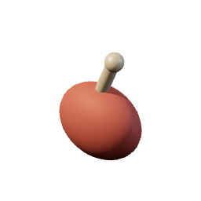 **Raw Game Meat** | 1 | resource | No | 12 | 7 | - |
| 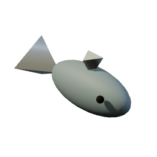 **Silt Minnow** | 1 | resource | No | 14 | 8 | - |
|  **Grithe Hatchet** | 1 | tool | No | 55 | 33 | Woodcutting +2 |
|  **Grithe Pickaxe** | 1 | tool | No | 60 | 36 | Mining +2 |
| 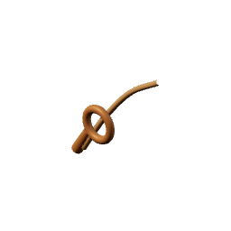 **Palewood Rod** | 1 | tool | No | 45 | 27 | Fishing +2 |
| 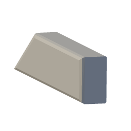 **Corven Bar** | 5 | bar | No | 110 | 66 | - |
|  **Bramble Hide** | 5 | component | No | 55 | 33 | - |
| 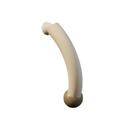 **Coyote Fang** | 5 | component | Yes | 58 | 35 | - |
| 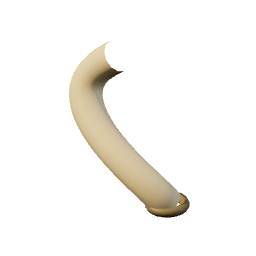 **Curved Tusk** | 5 | component | No | 72 | 43 | - |
| 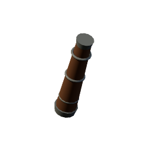 **Duskoak Handle** | 5 | component | Yes | 23 | 14 | - |
| 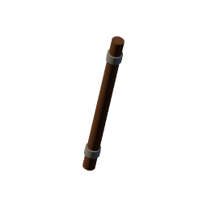 **Duskoak Shaft** | 5 | component | Yes | 14 | 8 | - |
| 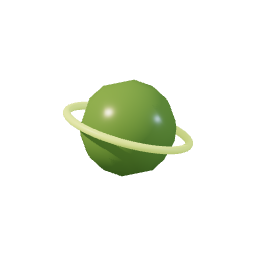 **Earth Orb** | 5 | component | No | 0 | 0 | boss altar key; awakens its regional altar for 1000-charge weapons; released |
| 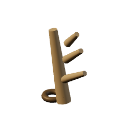 **Stag Antler** | 5 | component | No | 78 | 47 | - |
| 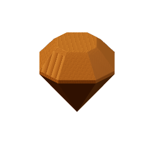 **Vell Amber** | 5 | component | Yes | 70 | 42 | - |
| 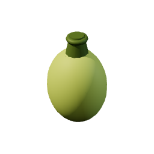 **Venom Gland** | 5 | component | Yes | 64 | 38 | - |
| 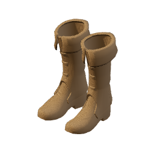 **Bramblehide Boots** | 5 | equipment | No | 220 | 132 | feet; Magic 5 |
|  **Bramblehide Hood** | 5 | equipment | No | 300 | 180 | head; Magic 5 |
|  **Bramblehide Leggings** | 5 | equipment | No | 540 | 324 | legs; Magic 5 |
|  **Bramblehide Robe** | 5 | equipment | No | 600 | 360 | body; Magic 5 |
|  **Bramblehide Wraps** | 5 | equipment | No | 220 | 132 | hands; Magic 5 |
|  **Corven Boots** | 5 | equipment | No | 260 | 156 | feet; Melee 5 |
|  **Corven Dagger** | 5 | equipment | No | 320 | 192 | mainHand; Melee 5 |
|  **Corven Gauntlets** | 5 | equipment | No | 260 | 156 | hands; Melee 5 |
|  **Corven Greaves** | 5 | equipment | No | 700 | 420 | legs; Melee 5 |
|  **Corven Helm** | 5 | equipment | No | 380 | 228 | head; Melee 5 |
|  **Corven Pendant** | 5 | equipment | No | 360 | 216 | accessory2; Melee 5 |
|  **Corven Plate** | 5 | equipment | No | 760 | 456 | body; Melee 5 |
|  **Corven Ring** | 5 | equipment | No | 330 | 198 | accessory1; Melee 5 |
|  **Corven Sword** | 5 | equipment | No | 620 | 372 | mainHand; Melee 5 |
|  **Duskoak Shield** | 5 | equipment | No | 240 | 144 | offHand; Melee 5 |
|  **Duskoak Staff** | 5 | equipment | No | 500 | 300 | mainHand; staff; 2-handed; 3.0 s cast cadence; Magic 5 |
|  **Duskoak Wand** | 5 | equipment | No | 340 | 204 | mainHand; wand; 1-handed; 2.2 s cast cadence; Magic 5 |
|  **Earth Staff** | 5 | equipment | No | 500 | 300 | mainHand; staff; 2-handed; 3.0 s cast cadence; 1000 Earth charges; Magic 5 |
|  **Earth Wand** | 5 | equipment | No | 340 | 204 | mainHand; wand; 1-handed; 2.2 s cast cadence; 1000 Earth charges; Magic 5 |
|  **Mossbound Staff** | 5 | equipment | No | 750 | 450 | mainHand; staff; 2-handed; 3.0 s cast cadence; Magic 5 |
|  **Mossbound Sword** | 5 | equipment | No | 930 | 558 | mainHand; Melee 5 |
|  **Stone Charm** | 5 | equipment | No | 360 | 216 | accessory2; Magic 5 |
|  **Stone Ring** | 5 | equipment | No | 330 | 198 | accessory1; Magic 5 |
|  **Burnt Trout** | 5 | food | No | 1 | 1 | - |
|  **Burnt Venison** | 5 | food | No | 1 | 1 | - |
|  **Roast Venison** | 5 | food | No | 66 | 40 | Heals 7 |
|  **Seared Trout** | 5 | food | No | 62 | 37 | Heals 7 |
|  **Bramble Trout** | 5 | resource | No | 44 | 26 | - |
|  **Corven Ore** | 5 | resource | No | 42 | 25 | - |
|  **Duskoak Log** | 5 | resource | No | 38 | 23 | - |
|  **Earth Essence** | 5 | resource | Yes | 24 | 14 | - |
|  **Raw Venison** | 5 | resource | No | 46 | 28 | - |
|  **Corven Hatchet** | 5 | tool | No | 225 | 135 | Woodcutting +5 |
|  **Corven Pickaxe** | 5 | tool | No | 240 | 144 | Mining +5 |
|  **Duskoak Rod** | 5 | tool | No | 190 | 114 | Fishing +5 |
|  **Kaldite Bar** | 10 | bar | No | 250 | 150 | - |
|  **Aurochs Horn** | 10 | component | No | 178 | 107 | - |
|  **Bear Claw** | 10 | component | Yes | 150 | 90 | - |
|  **Boar Bristle** | 10 | component | Yes | 96 | 58 | - |
|  **Cairn Garnet** | 10 | component | Yes | 160 | 96 | - |
|  **Cairn Pelt** | 10 | component | No | 130 | 78 | - |
|  **Cairnpine Handle** | 10 | component | Yes | 53 | 32 | - |
|  **Cairnpine Shaft** | 10 | component | Yes | 32 | 19 | - |
|  **Crab Claw** | 10 | component | No | 158 | 95 | - |
|  **Ibex Horn** | 10 | component | No | 165 | 99 | - |
|  **Rat Tail** | 10 | component | Yes | 84 | 50 | - |
|  **Scorpion Stinger** | 10 | component | Yes | 140 | 84 | - |
|  **Water Orb** | 10 | component | No | 0 | 0 | boss altar key; awakens its regional altar for 1000-charge weapons; released |
|  **Cairnpelt Boots** | 10 | equipment | No | 500 | 300 | feet; Magic 10 |
|  **Cairnpelt Hood** | 10 | equipment | No | 700 | 420 | head; Magic 10 |
|  **Cairnpelt Leggings** | 10 | equipment | No | 1260 | 756 | legs; Magic 10 |
|  **Cairnpelt Robe** | 10 | equipment | No | 1400 | 840 | body; Magic 10 |
|  **Cairnpelt Wraps** | 10 | equipment | No | 500 | 300 | hands; Magic 10 |
|  **Cairnpine Shield** | 10 | equipment | No | 560 | 336 | offHand; Melee 10 |
|  **Cairnpine Staff** | 10 | equipment | No | 1180 | 708 | mainHand; staff; 2-handed; 3.0 s cast cadence; Magic 10 |
|  **Cairnpine Wand** | 10 | equipment | No | 820 | 492 | mainHand; wand; 1-handed; 2.2 s cast cadence; Magic 10 |
|  **Kaldite Boots** | 10 | equipment | No | 600 | 360 | feet; Melee 10 |
|  **Kaldite Dagger** | 10 | equipment | No | 760 | 456 | mainHand; Melee 9 |
|  **Kaldite Gauntlets** | 10 | equipment | No | 600 | 360 | hands; Melee 10 |
|  **Kaldite Greaves** | 10 | equipment | No | 1620 | 972 | legs; Melee 10 |
|  **Kaldite Helm** | 10 | equipment | No | 880 | 528 | head; Melee 10 |
|  **Kaldite Pendant** | 10 | equipment | No | 840 | 504 | accessory2; Melee 10 |
|  **Kaldite Plate** | 10 | equipment | No | 1760 | 1056 | body; Melee 10 |
|  **Kaldite Ring** | 10 | equipment | No | 780 | 468 | accessory1; Melee 10 |
|  **Kaldite Sword** | 10 | equipment | No | 1450 | 870 | mainHand; Melee 10 |
|  **Storm Charm** | 10 | equipment | No | 840 | 504 | accessory2; Magic 10 |
|  **Storm Ring** | 10 | equipment | No | 780 | 468 | accessory1; Magic 10 |
|  **Tideworn Staff** | 10 | equipment | No | 1770 | 1062 | mainHand; staff; 2-handed; 3.0 s cast cadence; Magic 10 |
|  **Tideworn Sword** | 10 | equipment | No | 2175 | 1305 | mainHand; Melee 10 |
|  **Water Staff** | 10 | equipment | No | 1180 | 708 | mainHand; staff; 2-handed; 3.0 s cast cadence; 1000 Water charges; Magic 10 |
|  **Water Wand** | 10 | equipment | No | 820 | 492 | mainHand; wand; 1-handed; 2.2 s cast cadence; 1000 Water charges; Magic 10 |
|  **Burnt Cragfin** | 10 | food | No | 1 | 1 | - |
|  **Burnt Haunch** | 10 | food | No | 1 | 1 | - |
|  **Roast Haunch** | 10 | food | No | 118 | 71 | Heals 12 |
|  **Seared Cragfin** | 10 | food | No | 70 | 42 | Heals 12 |
|  **Cairnpine Log** | 10 | resource | No | 88 | 53 | - |
|  **Cragfin** | 10 | resource | No | 96 | 58 | - |
|  **Kaldite Ore** | 10 | resource | No | 95 | 57 | - |
|  **Raw Haunch** | 10 | resource | No | 88 | 53 | - |
|  **Water Essence** | 10 | resource | Yes | 55 | 33 | - |
|  **Cairnpine Rod** | 10 | tool | No | 480 | 288 | Fishing +9 |
|  **Kaldite Hatchet** | 10 | tool | No | 600 | 360 | Woodcutting +9 |
|  **Kaldite Pickaxe** | 10 | tool | No | 620 | 372 | Mining +9 |
|  **Emberite Bar** | 20 | bar | No | 760 | 456 | - |
|  **Ashback Claw** | 20 | component | Yes | 320 | 192 | - |
|  **Charhide** | 20 | component | No | 290 | 174 | - |
|  **Cinder Tusk** | 20 | component | No | 300 | 180 | - |
|  **Cinderpine Handle** | 20 | component | Yes | 117 | 70 | - |
|  **Cinderpine Shaft** | 20 | component | Yes | 70 | 42 | - |
|  **Emberhorn** | 20 | component | No | 360 | 216 | - |
|  **Fire Opal** | 20 | component | Yes | 350 | 210 | - |
|  **Fire Orb** | 20 | component | No | 0 | 0 | boss altar key; awakens its regional altar for 1000-charge weapons; released |
|  **Kiln Fang** | 20 | component | Yes | 310 | 186 | - |
|  **Charhide Boots** | 20 | equipment | No | 1150 | 690 | feet; Magic 20 |
|  **Charhide Hood** | 20 | equipment | No | 1650 | 990 | head; Magic 20 |
|  **Charhide Leggings** | 20 | equipment | No | 2950 | 1770 | legs; Magic 20 |
|  **Charhide Robe** | 20 | equipment | No | 3300 | 1980 | body; Magic 20 |
|  **Charhide Wraps** | 20 | equipment | No | 1150 | 690 | hands; Magic 20 |
|  **Cinder Charm** | 20 | equipment | No | 1900 | 1140 | accessory2; Magic 20 |
|  **Cinder Ring** | 20 | equipment | No | 1750 | 1050 | accessory1; Magic 20 |
|  **Cinderpine Shield** | 20 | equipment | No | 1250 | 750 | offHand; Melee 20 |
|  **Cinderpine Staff** | 20 | equipment | No | 2700 | 1620 | mainHand; staff; 2-handed; 3.0 s cast cadence; Magic 20 |
|  **Cinderpine Wand** | 20 | equipment | No | 1900 | 1140 | mainHand; wand; 1-handed; 2.2 s cast cadence; Magic 20 |
|  **Cinderwake Staff** | 20 | equipment | No | 4050 | 2430 | mainHand; staff; 2-handed; 3.0 s cast cadence; Magic 20 |
|  **Cinderwake Sword** | 20 | equipment | No | 4800 | 2880 | mainHand; Melee 20 |
|  **Emberite Boots** | 20 | equipment | No | 1350 | 810 | feet; Melee 20 |
|  **Emberite Dagger** | 20 | equipment | No | 1700 | 1020 | mainHand; Melee 19 |
|  **Emberite Gauntlets** | 20 | equipment | No | 1350 | 810 | hands; Melee 20 |
|  **Emberite Greaves** | 20 | equipment | No | 3600 | 2160 | legs; Melee 20 |
|  **Emberite Helm** | 20 | equipment | No | 1950 | 1170 | head; Melee 20 |
|  **Emberite Pendant** | 20 | equipment | No | 1900 | 1140 | accessory2; Melee 20 |
|  **Emberite Plate** | 20 | equipment | No | 3900 | 2340 | body; Melee 20 |
|  **Emberite Ring** | 20 | equipment | No | 1750 | 1050 | accessory1; Melee 20 |
|  **Emberite Sword** | 20 | equipment | No | 3200 | 1920 | mainHand; Melee 20 |
|  **Fire Staff** | 20 | equipment | No | 2700 | 1620 | mainHand; staff; 2-handed; 3.0 s cast cadence; 1000 Fire charges; Magic 20 |
|  **Fire Wand** | 20 | equipment | No | 1900 | 1140 | mainHand; wand; 1-handed; 2.2 s cast cadence; 1000 Fire charges; Magic 20 |
|  **Burnt Ashfin** | 20 | food | No | 1 | 1 | - |
|  **Burnt Ember Haunch** | 20 | food | No | 1 | 1 | - |
|  **Roast Ember Haunch** | 20 | food | No | 255 | 153 | Heals 19 |
|  **Seared Ashfin** | 20 | food | No | 150 | 90 | Heals 19 |
|  **Ashfin** | 20 | resource | No | 215 | 129 | - |
|  **Cinderpine Log** | 20 | resource | No | 195 | 117 | - |
|  **Emberite Ore** | 20 | resource | No | 210 | 126 | - |
|  **Fire Essence** | 20 | resource | Yes | 120 | 72 | - |
|  **Kilnstone** | 20 | resource | No | 12 | 7 | - |
|  **Raw Ember Haunch** | 20 | resource | No | 190 | 114 | - |
|  **Cinderpine Rod** | 20 | tool | No | 1100 | 660 | Fishing +17 |
|  **Emberite Hatchet** | 20 | tool | No | 1350 | 810 | Woodcutting +17 |
|  **Emberite Pickaxe** | 20 | tool | No | 1400 | 840 | Mining +17 |
