| Item | Tier | Category | Stacks | Buy | Sell | Use |
| --- | --- | --- | --- | --- | --- | --- |
|  **Worn Shortsword** | 0 | equipment | No | 15 | 9 | mainHand |
|  **Worn Hatchet** | 0 | tool | No | 8 | 5 | Woodcutting +1 |
|  **Worn Pickaxe** | 0 | tool | No | 8 | 5 | Mining +1 |
|  **Worn Rod** | 0 | tool | No | 6 | 4 | Fishing +1 |
|  **Grithe Bar** | 1 | bar | No | 30 | 18 | - |
|  **Coarse Hide** | 1 | component | No | 16 | 10 | - |
| 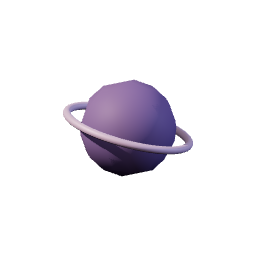 **Essence Shard** | 1 | component | Yes | 9 | 5 | - |
|  **Pale Quartz** | 1 | component | Yes | 20 | 12 | - |
|  **Palewood Shaft** | 1 | component | Yes | 4 | 2 | - |
|  **Marks** | 1 | currency | Yes | 1 | 1 | - |
|  **Ember Charm** | 1 | equipment | No | 105 | 63 | accessory2; Magic 1 |
|  **Ember Ring** | 1 | equipment | No | 95 | 57 | accessory1; Magic 1 |
|  **Grithe Boots** | 1 | equipment | No | 80 | 48 | feet; Melee 1 |
|  **Grithe Cuirass** | 1 | equipment | No | 220 | 132 | body; Melee 1 |
|  **Grithe Dagger** | 1 | equipment | No | 90 | 54 | mainHand; Melee 1 |
|  **Grithe Gloves** | 1 | equipment | No | 80 | 48 | hands; Melee 1 |
|  **Grithe Greaves** | 1 | equipment | No | 200 | 120 | legs; Melee 1 |
|  **Grithe Helm** | 1 | equipment | No | 110 | 66 | head; Melee 1 |
|  **Grithe Pendant** | 1 | equipment | No | 105 | 63 | accessory2; Melee 1 |
|  **Grithe Ring** | 1 | equipment | No | 95 | 57 | accessory1; Melee 1 |
|  **Grithe Sword** | 1 | equipment | No | 180 | 108 | mainHand; Melee 1 |
|  **Marchhide Boots** | 1 | equipment | No | 65 | 39 | feet; Magic 1 |
|  **Marchhide Hood** | 1 | equipment | No | 90 | 54 | head; Magic 1 |
|  **Marchhide Leggings** | 1 | equipment | No | 150 | 90 | legs; Magic 1 |
|  **Marchhide Robe** | 1 | equipment | No | 170 | 102 | body; Magic 1 |
|  **Marchhide Wraps** | 1 | equipment | No | 65 | 39 | hands; Magic 1 |
|  **Palewood Shield** | 1 | equipment | No | 70 | 42 | offHand; Melee 1 |
|  **Palewood Staff** | 1 | equipment | No | 140 | 84 | mainHand; Magic 1 |
| 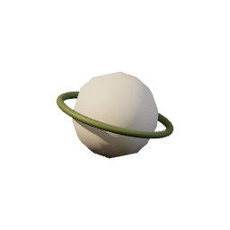 **Quartz Focus** | 1 | equipment | No | 70 | 42 | offHand; Magic 1 |
|  **Burnt Minnow** | 1 | food | No | 1 | 1 | - |
|  **Seared Minnow** | 1 | food | No | 22 | 13 | Heals 3 |
|  **Bittergrain** | 1 | resource | No | 9 | 5 | - |
|  **Grithe Ore** | 1 | resource | No | 12 | 7 | - |
|  **March Stone** | 1 | resource | No | 5 | 3 | - |
|  **Palewood Log** | 1 | resource | No | 10 | 6 | - |
|  **Silt Minnow** | 1 | resource | No | 14 | 8 | - |
| 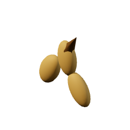 **Bittergrain Seed** | 1 | seed | Yes | 6 | 4 | - |
|  **Grithe Hatchet** | 1 | tool | No | 55 | 33 | Woodcutting +2 |
|  **Grithe Pickaxe** | 1 | tool | No | 60 | 36 | Mining +2 |
|  **Palewood Rod** | 1 | tool | No | 45 | 27 | Fishing +2 |
|  **Corven Bar** | 5 | bar | No | 110 | 66 | - |
|  **Bramble Hide** | 5 | component | No | 55 | 33 | - |
|  **Duskoak Shaft** | 5 | component | Yes | 14 | 8 | - |
|  **Vell Amber** | 5 | component | Yes | 70 | 42 | - |
| 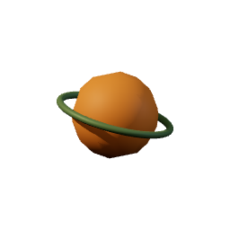 **Amber Focus** | 5 | equipment | No | 240 | 144 | offHand; Magic 5 |
|  **Bramblehide Boots** | 5 | equipment | No | 220 | 132 | feet; Magic 5 |
|  **Bramblehide Hood** | 5 | equipment | No | 300 | 180 | head; Magic 5 |
|  **Bramblehide Leggings** | 5 | equipment | No | 540 | 324 | legs; Magic 5 |
|  **Bramblehide Robe** | 5 | equipment | No | 600 | 360 | body; Magic 5 |
|  **Bramblehide Wraps** | 5 | equipment | No | 220 | 132 | hands; Magic 5 |
|  **Corven Boots** | 5 | equipment | No | 260 | 156 | feet; Melee 5 |
|  **Corven Dagger** | 5 | equipment | No | 320 | 192 | mainHand; Melee 5 |
|  **Corven Gauntlets** | 5 | equipment | No | 260 | 156 | hands; Melee 5 |
|  **Corven Greaves** | 5 | equipment | No | 700 | 420 | legs; Melee 5 |
|  **Corven Helm** | 5 | equipment | No | 380 | 228 | head; Melee 5 |
|  **Corven Pendant** | 5 | equipment | No | 360 | 216 | accessory2; Melee 5 |
|  **Corven Plate** | 5 | equipment | No | 760 | 456 | body; Melee 5 |
|  **Corven Ring** | 5 | equipment | No | 330 | 198 | accessory1; Melee 5 |
|  **Corven Sword** | 5 | equipment | No | 620 | 372 | mainHand; Melee 5 |
|  **Duskoak Shield** | 5 | equipment | No | 240 | 144 | offHand; Melee 5 |
|  **Duskoak Staff** | 5 | equipment | No | 500 | 300 | mainHand; Magic 5 |
|  **Stone Charm** | 5 | equipment | No | 360 | 216 | accessory2; Magic 5 |
|  **Stone Ring** | 5 | equipment | No | 330 | 198 | accessory1; Magic 5 |
|  **Burnt Trout** | 5 | food | No | 1 | 1 | - |
|  **Seared Trout** | 5 | food | No | 62 | 37 | Heals 7 |
|  **Bramble Trout** | 5 | resource | No | 44 | 26 | - |
|  **Corven Ore** | 5 | resource | No | 42 | 25 | - |
| 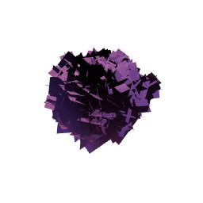 **Duskberry** | 5 | resource | No | 30 | 18 | - |
|  **Duskoak Log** | 5 | resource | No | 38 | 23 | - |
| 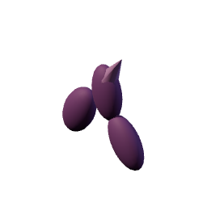 **Duskberry Seed** | 5 | seed | Yes | 22 | 13 | - |
|  **Corven Hatchet** | 5 | tool | No | 225 | 135 | Woodcutting +5 |
|  **Corven Pickaxe** | 5 | tool | No | 240 | 144 | Mining +5 |
|  **Duskoak Rod** | 5 | tool | No | 190 | 114 | Fishing +5 |
|  **Kaldite Bar** | 10 | bar | No | 250 | 150 | - |
|  **Cairn Garnet** | 10 | component | Yes | 160 | 96 | - |
|  **Cairnpine Shaft** | 10 | component | Yes | 32 | 19 | - |
|  **Wight Shroud** | 10 | component | No | 130 | 78 | - |
|  **Cairnpine Shield** | 10 | equipment | No | 560 | 336 | offHand; Melee 10 |
|  **Cairnpine Staff** | 10 | equipment | No | 1180 | 708 | mainHand; Magic 10 |
| 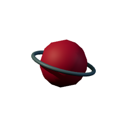 **Garnet Focus** | 10 | equipment | No | 560 | 336 | offHand; Magic 10 |
|  **Kaldite Boots** | 10 | equipment | No | 600 | 360 | feet; Melee 10 |
|  **Kaldite Dagger** | 10 | equipment | No | 760 | 456 | mainHand; Melee 9 |
|  **Kaldite Gauntlets** | 10 | equipment | No | 600 | 360 | hands; Melee 10 |
|  **Kaldite Greaves** | 10 | equipment | No | 1620 | 972 | legs; Melee 10 |
|  **Kaldite Helm** | 10 | equipment | No | 880 | 528 | head; Melee 10 |
|  **Kaldite Pendant** | 10 | equipment | No | 840 | 504 | accessory2; Melee 10 |
|  **Kaldite Plate** | 10 | equipment | No | 1760 | 1056 | body; Melee 10 |
|  **Kaldite Ring** | 10 | equipment | No | 780 | 468 | accessory1; Melee 10 |
|  **Kaldite Sword** | 10 | equipment | No | 1450 | 870 | mainHand; Melee 10 |
|  **Storm Charm** | 10 | equipment | No | 840 | 504 | accessory2; Magic 10 |
|  **Storm Ring** | 10 | equipment | No | 780 | 468 | accessory1; Magic 10 |
|  **Wightshroud Boots** | 10 | equipment | No | 500 | 300 | feet; Magic 10 |
| 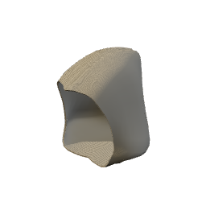 **Wightshroud Hood** | 10 | equipment | No | 700 | 420 | head; Magic 10 |
| 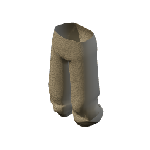 **Wightshroud Leggings** | 10 | equipment | No | 1260 | 756 | legs; Magic 10 |
| 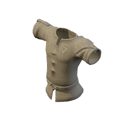 **Wightshroud Robe** | 10 | equipment | No | 1400 | 840 | body; Magic 10 |
|  **Wightshroud Wraps** | 10 | equipment | No | 500 | 300 | hands; Magic 10 |
|  **Burnt Cragfin** | 10 | food | No | 1 | 1 | - |
|  **Seared Cragfin** | 10 | food | No | 70 | 42 | Heals 12 |
|  **Cairnleaf** | 10 | resource | No | 74 | 44 | - |
|  **Cairnpine Log** | 10 | resource | No | 88 | 53 | - |
|  **Cragfin** | 10 | resource | No | 96 | 58 | - |
|  **Kaldite Ore** | 10 | resource | No | 95 | 57 | - |
| 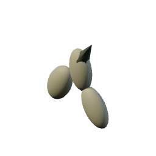 **Cairnleaf Seed** | 10 | seed | Yes | 52 | 31 | - |
|  **Cairnpine Rod** | 10 | tool | No | 480 | 288 | Fishing +9 |
|  **Kaldite Hatchet** | 10 | tool | No | 600 | 360 | Woodcutting +9 |
|  **Kaldite Pickaxe** | 10 | tool | No | 620 | 372 | Mining +9 |
