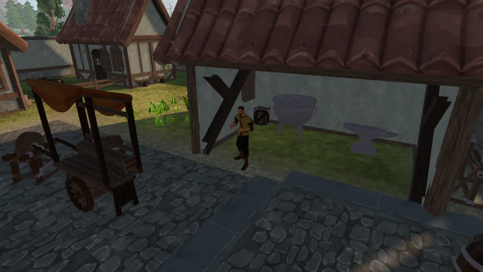
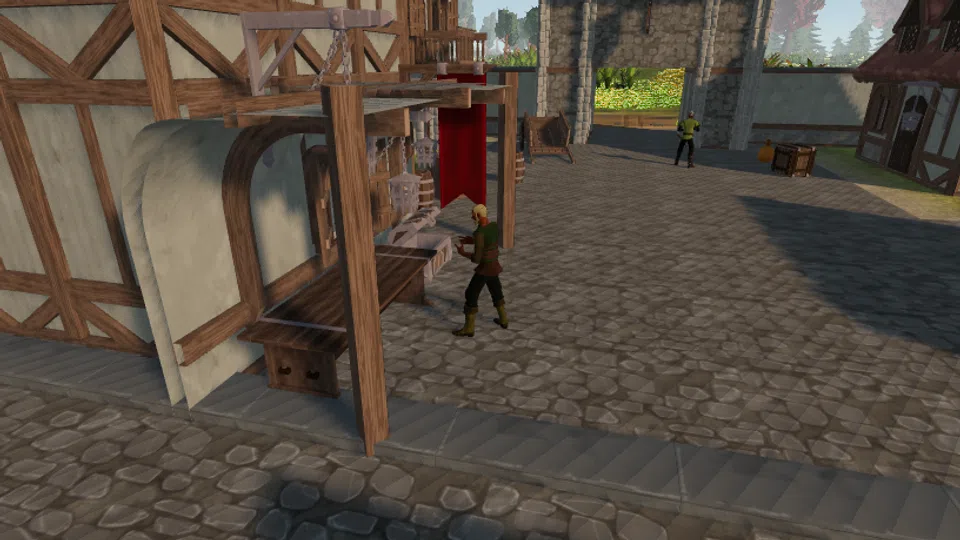
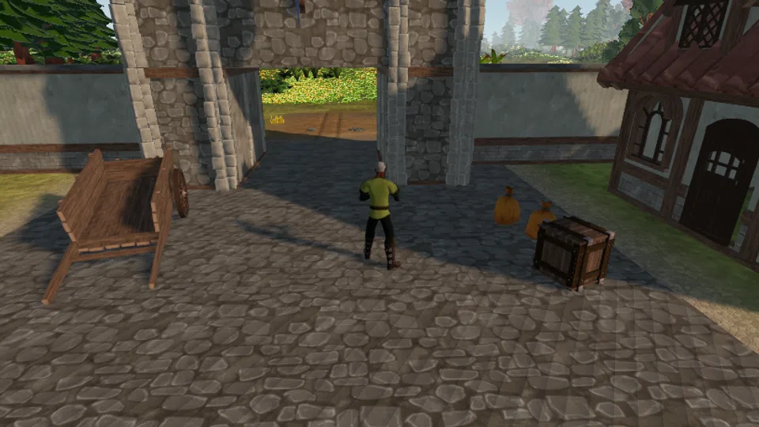
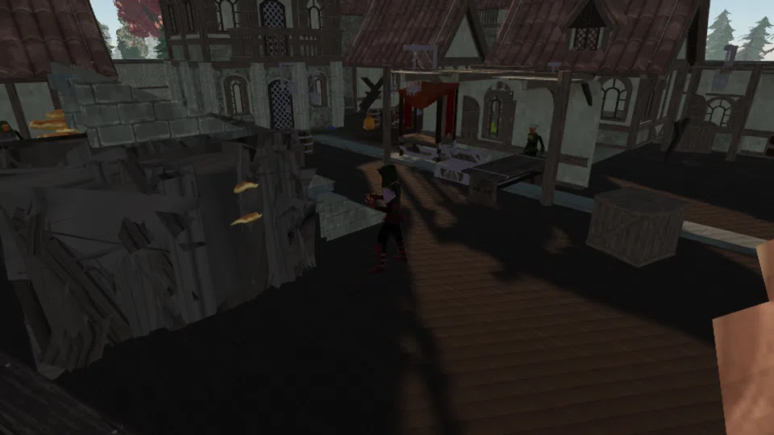
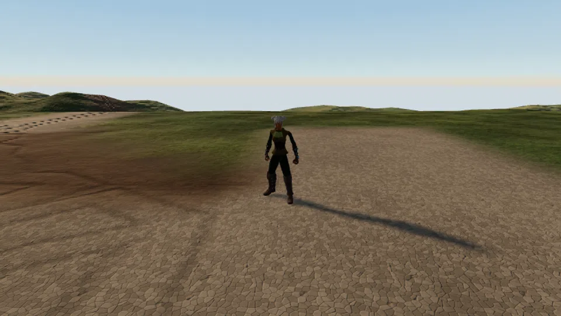
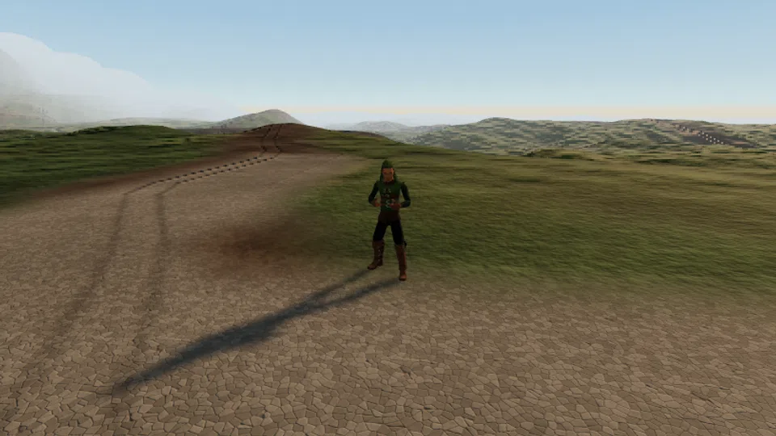
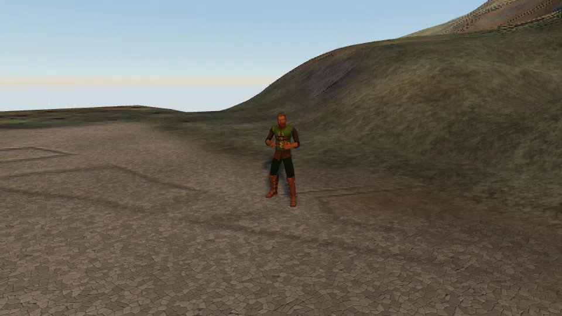
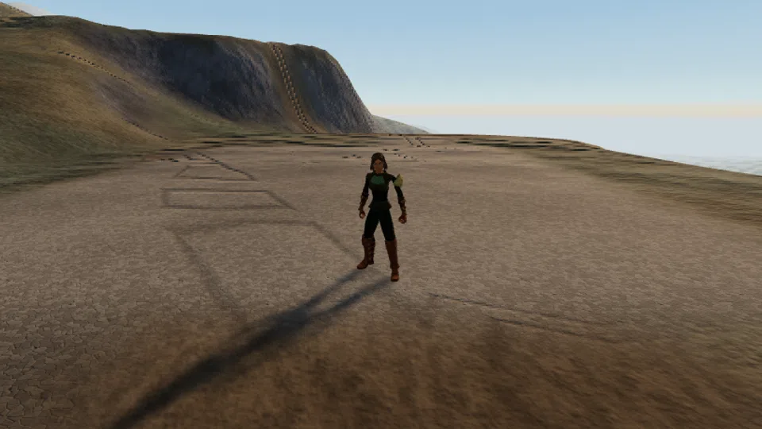

## Cold Iron

Harrow the smith will not sell a weapon to somebody who has never made one. Pull Grithe out of the Bracken Pit, melt it, beat it into a dagger, and go and find out whether it holds.

| Giver | Region | Requirements | Prerequisite |
| --- | --- | --- | --- |
| Harrow the Smith | Fallowmarch | None | None |

### Walkthrough

#### 1. Mine 6 Grithe ore at the Bracken Pit.

Six seams stand at the pit, 160 m north of Coldbrace. `moveTo({ locationId: "bracken_pit" })`, then `interact(<ore entity id>, "mine")`. Mining 1 is enough.

<nav class="corealm-quest-where" aria-label="Locations for step 1">Where<a href="./locations/#bracken-pit">Bracken Pit</a></nav>
<nav class="corealm-quest-items" aria-label="Items for step 1">Items<a href="./items/#grithe-ore">Grithe Ore</a></nav>

<figure class="corealm-quest-scene"><figcaption><strong>Bracken Pit</strong>Bracken Pit</figcaption></figure>

<figure class="corealm-location-map corealm-quest-map" data-location-map style="--map-image-ratio:1.3333333333333333">

<a class="corealm-map-marker" href="./locations/#bracken-pit" style="--map-x:36.6667%;--map-y:43.3333%" data-map-side="right" data-map-kind="seam" data-map-marker aria-label="Bracken Pit, Fallowmarch" title="Bracken Pit, Fallowmarch">Bracken Pit<small>Fallowmarch</small></a>

N

<button type="button" data-map-action="out" aria-label="Zoom out" title="Zoom out">&minus;</button>
<button type="button" data-map-action="reset" aria-label="Reset map" title="Reset map">&#x25CE;</button>
<button type="button" data-map-action="in" aria-label="Zoom in" title="Zoom in">+</button>

<button class="corealm-map-expand" type="button" data-map-action="expand" aria-label="Expand map" aria-pressed="false" title="Expand map">&#x26F6;</button>

<figcaption>Bracken Pit.</figcaption>
</figure>

#### 2. Smelt 2 Grithe bars at the Coldbrace Furnace.

Stand at the furnace and `produce("smelt_grithe_bar", 2)`. The furnace is in the forge yard on the east side of Coldbrace Square.

<nav class="corealm-quest-where" aria-label="Locations for step 2">Where<a href="./locations/#coldbrace-square">Coldbrace Square</a></nav>
<nav class="corealm-quest-items" aria-label="Items for step 2">Items<a href="./items/#grithe-bar">Grithe Bar</a></nav>

<figure class="corealm-quest-scene"><figcaption><strong>Coldbrace Furnace</strong>Coldbrace Square</figcaption></figure>

<figure class="corealm-location-map corealm-quest-map" data-location-map style="--map-image-ratio:1.3333333333333333">

<a class="corealm-map-marker" href="./locations/#coldbrace-square" style="--map-x:37.9500%;--map-y:57.2500%" data-map-side="right" data-map-kind="entity" data-map-marker aria-label="Coldbrace Furnace, Fallowmarch" title="Coldbrace Furnace, Fallowmarch">Coldbrace Furnace<small>Fallowmarch</small></a>

N

<button type="button" data-map-action="out" aria-label="Zoom out" title="Zoom out">&minus;</button>
<button type="button" data-map-action="reset" aria-label="Reset map" title="Reset map">&#x25CE;</button>
<button type="button" data-map-action="in" aria-label="Zoom in" title="Zoom in">+</button>

<button class="corealm-map-expand" type="button" data-map-action="expand" aria-label="Expand map" aria-pressed="false" title="Expand map">&#x26F6;</button>

<figcaption>Coldbrace Square.</figcaption>
</figure>

#### 3. Smith a Grithe dagger at the Coldbrace Anvil.

The anvil stands four metres from the furnace. The dagger is the cheapest thing on it.

<nav class="corealm-quest-where" aria-label="Locations for step 3">Where<a href="./locations/#coldbrace-square">Coldbrace Square</a></nav>
<nav class="corealm-quest-items" aria-label="Items for step 3">Items<a href="./items/#grithe-dagger">Grithe Dagger</a></nav>

<figure class="corealm-quest-scene"><figcaption><strong>Coldbrace Anvil</strong>Coldbrace Square</figcaption></figure>

<figure class="corealm-location-map corealm-quest-map" data-location-map style="--map-image-ratio:1.3333333333333333">

<a class="corealm-map-marker" href="./locations/#coldbrace-square" style="--map-x:37.9333%;--map-y:57.0500%" data-map-side="right" data-map-kind="entity" data-map-marker aria-label="Coldbrace Anvil, Fallowmarch" title="Coldbrace Anvil, Fallowmarch">Coldbrace Anvil<small>Fallowmarch</small></a>

N

<button type="button" data-map-action="out" aria-label="Zoom out" title="Zoom out">&minus;</button>
<button type="button" data-map-action="reset" aria-label="Reset map" title="Reset map">&#x25CE;</button>
<button type="button" data-map-action="in" aria-label="Zoom in" title="Zoom in">+</button>

<button class="corealm-map-expand" type="button" data-map-action="expand" aria-label="Expand map" aria-pressed="false" title="Expand map">&#x26F6;</button>

<figcaption>Coldbrace Square.</figcaption>
</figure>

#### 4. Equip the Grithe dagger and kill 3 Rill Skitterlings on the brook flats south-east of town.

`equipItem("grithe_dagger")` first - the stage checks the slot, not just the bag. The Rill Skitterlings are passive and sit around (-88, -70), between town and the shallows.

<nav class="corealm-quest-where" aria-label="Locations for step 4">Where<a href="./locations/#redsill-shallows">Redsill Shallows</a></nav>
<nav class="corealm-quest-items" aria-label="Items for step 4">Items<a href="./items/#grithe-dagger">Grithe Dagger</a></nav>

<figure class="corealm-quest-scene"><figcaption><strong>Rill Skitterling</strong>Redsill Shallows</figcaption></figure>

<figure class="corealm-location-map corealm-quest-map" data-location-map style="--map-image-ratio:1.3333333333333333">

<a class="corealm-map-marker" href="./bestiary/#rill-skitterling" style="--map-x:42.6667%;--map-y:55.8333%" data-map-side="right" data-map-kind="enemy" data-map-marker aria-label="Rill Skitterling, Fallowmarch" title="Rill Skitterling, Fallowmarch">Rill Skitterling<small>Fallowmarch</small></a>
<a class="corealm-map-marker" href="./locations/#redsill-shallows" style="--map-x:46.6667%;--map-y:55.0000%" data-map-side="right" data-map-kind="water" data-map-marker aria-label="Redsill Shallows, Fallowmarch" title="Redsill Shallows, Fallowmarch">Redsill Shallows<small>Fallowmarch</small></a>

N

<button type="button" data-map-action="out" aria-label="Zoom out" title="Zoom out">&minus;</button>
<button type="button" data-map-action="reset" aria-label="Reset map" title="Reset map">&#x25CE;</button>
<button type="button" data-map-action="in" aria-label="Zoom in" title="Zoom in">+</button>

<button class="corealm-map-expand" type="button" data-map-action="expand" aria-label="Expand map" aria-pressed="false" title="Expand map">&#x26F6;</button>

<figcaption>Redsill Shallows.</figcaption>
</figure>

#### 5. Tell Harrow the Smith that the dagger held.

Walk back into Coldbrace Square and `interact("npc_smith_harrow", "talk")`.

<nav class="corealm-quest-where" aria-label="Locations for step 5">Where<a href="./locations/#coldbrace-square">Coldbrace Square</a></nav>

<figure class="corealm-quest-scene"><figcaption><strong>Harrow the Smith</strong>Coldbrace Square</figcaption></figure>

<figure class="corealm-location-map corealm-quest-map" data-location-map style="--map-image-ratio:1.3333333333333333">

<a class="corealm-map-marker" href="./npcs/#harrow-the-smith" style="--map-x:37.7167%;--map-y:57.2833%" data-map-side="right" data-map-kind="npc" data-map-marker aria-label="Harrow the Smith, Fallowmarch" title="Harrow the Smith, Fallowmarch">Harrow the Smith<small>Fallowmarch</small></a>

N

<button type="button" data-map-action="out" aria-label="Zoom out" title="Zoom out">&minus;</button>
<button type="button" data-map-action="reset" aria-label="Reset map" title="Reset map">&#x25CE;</button>
<button type="button" data-map-action="in" aria-label="Zoom in" title="Zoom in">+</button>

<button class="corealm-map-expand" type="button" data-map-action="expand" aria-label="Expand map" aria-pressed="false" title="Expand map">&#x26F6;</button>

<figcaption>Coldbrace Square.</figcaption>
</figure>

### Completion rewards

| Reward | Amount |
| --- | --- |
| Mining XP | 120 |
| Smithing XP | 140 |
| Melee XP | 60 |
| Grithe Hatchet | 1 |
| Seared Minnow | 5 |
| Marks | 150 |
| Unlock | Harrow will talk about the higher tiers. |
| Unlock | The rest of Coldbrace will give you work. |

## Dorn's Tally

The March Company ledger says a Grithe seam is worth four loads. Pitmaster Dorn has been signing that figure for nine years and has never once believed it. Work a seam to the bottom, count what it actually gave, and settle the argument with a number.

| Giver | Region | Requirements | Prerequisite |
| --- | --- | --- | --- |
| Pitmaster Dorn | Fallowmarch | None | None |

### Walkthrough

#### 1. Work one Grithe seam at the Bracken Pit until it is worked out. Stay on the same seam: Dorn wants the count from one node, not from six.

Pick one seam and stay on it. `inspect` the node while you work: its `resource.remaining` counts down, and the event that ends it carries `yieldsTaken`, which is the number Dorn wants.

<nav class="corealm-quest-where" aria-label="Locations for step 1">Where<a href="./locations/#bracken-pit">Bracken Pit</a></nav>
<nav class="corealm-quest-items" aria-label="Items for step 1">Items<a href="./items/#grithe-ore">Grithe Ore</a></nav>

<figure class="corealm-quest-scene"><figcaption><strong>Bracken Pit</strong>Bracken Pit</figcaption></figure>

<figure class="corealm-location-map corealm-quest-map" data-location-map style="--map-image-ratio:1.3333333333333333">

<a class="corealm-map-marker" href="./locations/#bracken-pit" style="--map-x:36.6667%;--map-y:43.3333%" data-map-side="right" data-map-kind="seam" data-map-marker aria-label="Bracken Pit, Fallowmarch" title="Bracken Pit, Fallowmarch">Bracken Pit<small>Fallowmarch</small></a>

N

<button type="button" data-map-action="out" aria-label="Zoom out" title="Zoom out">&minus;</button>
<button type="button" data-map-action="reset" aria-label="Reset map" title="Reset map">&#x25CE;</button>
<button type="button" data-map-action="in" aria-label="Zoom in" title="Zoom in">+</button>

<button class="corealm-map-expand" type="button" data-map-action="expand" aria-label="Expand map" aria-pressed="false" title="Expand map">&#x26F6;</button>

<figcaption>Bracken Pit.</figcaption>
</figure>

**Stage reward**

| Reward | Amount |
| --- | --- |
| Mining XP | 40 |

#### 2. Tell Pitmaster Dorn how many loads the seam actually gave. He offers three bands; pick the one your seam fell into.

The exact figure was in the `resource.depleted` event, and the quest kept it: it is the `last_seam_yield` counter on this quest's record. Guess wrong and Dorn sends you back to check, which costs nothing but a walk.

<nav class="corealm-quest-where" aria-label="Locations for step 2">Where<a href="./locations/#coldbrace-square">Coldbrace Square</a></nav>

<figure class="corealm-quest-scene"><figcaption><strong>Pitmaster Dorn</strong>Coldbrace Square</figcaption></figure>

<figure class="corealm-location-map corealm-quest-map" data-location-map style="--map-image-ratio:1.3333333333333333">

<a class="corealm-map-marker" href="./npcs/#pitmaster-dorn" style="--map-x:36.4833%;--map-y:57.3750%" data-map-side="right" data-map-kind="npc" data-map-marker aria-label="Pitmaster Dorn, Fallowmarch" title="Pitmaster Dorn, Fallowmarch">Pitmaster Dorn<small>Fallowmarch</small></a>

N

<button type="button" data-map-action="out" aria-label="Zoom out" title="Zoom out">&minus;</button>
<button type="button" data-map-action="reset" aria-label="Reset map" title="Reset map">&#x25CE;</button>
<button type="button" data-map-action="in" aria-label="Zoom in" title="Zoom in">+</button>

<button class="corealm-map-expand" type="button" data-map-action="expand" aria-label="Expand map" aria-pressed="false" title="Expand map">&#x26F6;</button>

<figcaption>Coldbrace Square.</figcaption>
</figure>

**Stage reward**

| Reward | Amount |
| --- | --- |
| Mining XP | 60 |

#### 3. Make the vault agree with the ledger: bank 15 Grithe ore at the Coldbrace Bank.

Walk to the bank counter and `bank("deposit", { itemId: "grithe_ore", quantity: -1 })`. The stage counts what is in the bank, not what you carried in.

<nav class="corealm-quest-where" aria-label="Locations for step 3">Where<a href="./locations/#coldbrace-bank">Coldbrace Bank</a></nav>
<nav class="corealm-quest-items" aria-label="Items for step 3">Items<a href="./items/#grithe-ore">Grithe Ore</a></nav>

<figure class="corealm-quest-scene"><figcaption><strong>Coldbrace Bank</strong>Coldbrace Bank</figcaption></figure>

<figure class="corealm-location-map corealm-quest-map" data-location-map style="--map-image-ratio:1.3333333333333333">

<a class="corealm-map-marker" href="./locations/#coldbrace-bank" style="--map-x:36.3542%;--map-y:57.5333%" data-map-side="right" data-map-kind="entity" data-map-marker aria-label="Coldbrace Bank, Fallowmarch" title="Coldbrace Bank, Fallowmarch">Coldbrace Bank<small>Fallowmarch</small></a>

N

<button type="button" data-map-action="out" aria-label="Zoom out" title="Zoom out">&minus;</button>
<button type="button" data-map-action="reset" aria-label="Reset map" title="Reset map">&#x25CE;</button>
<button type="button" data-map-action="in" aria-label="Zoom in" title="Zoom in">+</button>

<button class="corealm-map-expand" type="button" data-map-action="expand" aria-label="Expand map" aria-pressed="false" title="Expand map">&#x26F6;</button>

<figcaption>Coldbrace Bank.</figcaption>
</figure>

#### 4. Sign the corrected page with Pitmaster Dorn.

Back to the square. He will have a pen ready; he always has a pen ready.

<nav class="corealm-quest-where" aria-label="Locations for step 4">Where<a href="./locations/#coldbrace-square">Coldbrace Square</a></nav>

<figure class="corealm-quest-scene"><figcaption><strong>Pitmaster Dorn</strong>Coldbrace Square</figcaption></figure>

<figure class="corealm-location-map corealm-quest-map" data-location-map style="--map-image-ratio:1.3333333333333333">

<a class="corealm-map-marker" href="./npcs/#pitmaster-dorn" style="--map-x:36.4833%;--map-y:57.3750%" data-map-side="right" data-map-kind="npc" data-map-marker aria-label="Pitmaster Dorn, Fallowmarch" title="Pitmaster Dorn, Fallowmarch">Pitmaster Dorn<small>Fallowmarch</small></a>

N

<button type="button" data-map-action="out" aria-label="Zoom out" title="Zoom out">&minus;</button>
<button type="button" data-map-action="reset" aria-label="Reset map" title="Reset map">&#x25CE;</button>
<button type="button" data-map-action="in" aria-label="Zoom in" title="Zoom in">+</button>

<button class="corealm-map-expand" type="button" data-map-action="expand" aria-label="Expand map" aria-pressed="false" title="Expand map">&#x26F6;</button>

<figcaption>Coldbrace Square.</figcaption>
</figure>

### Completion rewards

| Reward | Amount |
| --- | --- |
| Mining XP | 260 |
| Grithe Pickaxe | 1 |
| Marks | 220 |
| Unlock | Dorn will quote you real seam figures instead of the ledger's. |

## Bright Water

Ranger Syb has walked the march for eleven weeks and eaten cold things for eleven weeks. She has stopped complaining about it, which everyone agrees is worse.

| Giver | Region | Requirements | Prerequisite |
| --- | --- | --- | --- |
| Ranger Syb | Fallowmarch | None | None |

### Supplied when accepted

| Item | Amount |
| --- | --- |
| Bittergrain Seed | 4 |
| Unlock | Syb hands you four Bittergrain seeds. |

### Walkthrough

#### 1. Rake a plot at Marchfield, plant a Bittergrain seed, and harvest 3 Bittergrain.

Six plots sit inside the old wall line. `interact(<plot>, "rake")`, then `"plant"`, then wait for the plot to read `ready` and `"harvest"`. Bittergrain takes about four minutes of game time.

<nav class="corealm-quest-where" aria-label="Locations for step 1">Where<a href="./locations/#marchfield">Marchfield</a></nav>
<nav class="corealm-quest-items" aria-label="Items for step 1">Items<a href="./items/#bittergrain">Bittergrain</a></nav>

<figure class="corealm-quest-scene"><figcaption><strong>Marchfield</strong>Marchfield</figcaption></figure>

<figure class="corealm-location-map corealm-quest-map" data-location-map style="--map-image-ratio:1.3333333333333333">

<a class="corealm-map-marker" href="./locations/#marchfield" style="--map-x:42.0000%;--map-y:51.8333%" data-map-side="right" data-map-kind="farm" data-map-marker aria-label="Marchfield, Fallowmarch" title="Marchfield, Fallowmarch">Marchfield<small>Fallowmarch</small></a>

N

<button type="button" data-map-action="out" aria-label="Zoom out" title="Zoom out">&minus;</button>
<button type="button" data-map-action="reset" aria-label="Reset map" title="Reset map">&#x25CE;</button>
<button type="button" data-map-action="in" aria-label="Zoom in" title="Zoom in">+</button>

<button class="corealm-map-expand" type="button" data-map-action="expand" aria-label="Expand map" aria-pressed="false" title="Expand map">&#x26F6;</button>

<figcaption>Marchfield.</figcaption>
</figure>

**Stage reward**

| Reward | Amount |
| --- | --- |
| Farming XP | 45 |

#### 2. Catch 4 Silt Minnow at Redsill Shallows.

Four fishing spots on the red silt, 120 m east of town. `interact(<spot>, "fish")`. Fishing 1 is enough; a rod is not required, only slower without one.

<nav class="corealm-quest-where" aria-label="Locations for step 2">Where<a href="./locations/#redsill-shallows">Redsill Shallows</a></nav>
<nav class="corealm-quest-items" aria-label="Items for step 2">Items<a href="./items/#silt-minnow">Silt Minnow</a></nav>

<figure class="corealm-quest-scene"><figcaption><strong>Redsill Shallows</strong>Redsill Shallows</figcaption></figure>

<figure class="corealm-location-map corealm-quest-map" data-location-map style="--map-image-ratio:1.3333333333333333">

<a class="corealm-map-marker" href="./locations/#redsill-shallows" style="--map-x:46.6667%;--map-y:55.0000%" data-map-side="right" data-map-kind="water" data-map-marker aria-label="Redsill Shallows, Fallowmarch" title="Redsill Shallows, Fallowmarch">Redsill Shallows<small>Fallowmarch</small></a>

N

<button type="button" data-map-action="out" aria-label="Zoom out" title="Zoom out">&minus;</button>
<button type="button" data-map-action="reset" aria-label="Reset map" title="Reset map">&#x25CE;</button>
<button type="button" data-map-action="in" aria-label="Zoom in" title="Zoom in">+</button>

<button class="corealm-map-expand" type="button" data-map-action="expand" aria-label="Expand map" aria-pressed="false" title="Expand map">&#x26F6;</button>

<figcaption>Redsill Shallows.</figcaption>
</figure>

**Stage reward**

| Reward | Amount |
| --- | --- |
| Fishing XP | 45 |

#### 3. Cook 2 Seared Minnow at the Coldbrace Cooking Range.

At Cooking 1 nearly half of them burn. That is the rule, not bad luck - cook spares. Burnt Minnow does not count.

<nav class="corealm-quest-where" aria-label="Locations for step 3">Where<a href="./locations/#coldbrace-square">Coldbrace Square</a></nav>
<nav class="corealm-quest-items" aria-label="Items for step 3">Items<a href="./items/#seared-minnow">Seared Minnow</a></nav>

<figure class="corealm-quest-scene"><figcaption><strong>Coldbrace Cooking Range</strong>Coldbrace Square</figcaption></figure>

<figure class="corealm-location-map corealm-quest-map" data-location-map style="--map-image-ratio:1.3333333333333333">

<a class="corealm-map-marker" href="./locations/#coldbrace-square" style="--map-x:37.5833%;--map-y:56.0250%" data-map-side="right" data-map-kind="entity" data-map-marker aria-label="Coldbrace Cooking Range, Fallowmarch" title="Coldbrace Cooking Range, Fallowmarch">Coldbrace Cooking Range<small>Fallowmarch</small></a>

N

<button type="button" data-map-action="out" aria-label="Zoom out" title="Zoom out">&minus;</button>
<button type="button" data-map-action="reset" aria-label="Reset map" title="Reset map">&#x25CE;</button>
<button type="button" data-map-action="in" aria-label="Zoom in" title="Zoom in">+</button>

<button class="corealm-map-expand" type="button" data-map-action="expand" aria-label="Expand map" aria-pressed="false" title="Expand map">&#x26F6;</button>

<figcaption>Coldbrace Square.</figcaption>
</figure>

**Stage reward**

| Reward | Amount |
| --- | --- |
| Cooking XP | 45 |

#### 4. Give Ranger Syb 2 Seared Minnow and 3 Bittergrain, and watch her eat a hot meal.

She is in Coldbrace Square. The handover takes the food out of your bag.

<nav class="corealm-quest-where" aria-label="Locations for step 4">Where<a href="./locations/#coldbrace-square">Coldbrace Square</a></nav>
<nav class="corealm-quest-items" aria-label="Items for step 4">Items<a href="./items/#seared-minnow">Seared Minnow</a><a href="./items/#bittergrain">Bittergrain</a></nav>

<figure class="corealm-quest-scene"><figcaption><strong>Ranger Syb</strong>Coldbrace Square</figcaption></figure>

<figure class="corealm-location-map corealm-quest-map" data-location-map style="--map-image-ratio:1.3333333333333333">

<a class="corealm-map-marker" href="./npcs/#ranger-syb" style="--map-x:35.2500%;--map-y:56.1833%" data-map-side="right" data-map-kind="npc" data-map-marker aria-label="Ranger Syb, Fallowmarch" title="Ranger Syb, Fallowmarch">Ranger Syb<small>Fallowmarch</small></a>

N

<button type="button" data-map-action="out" aria-label="Zoom out" title="Zoom out">&minus;</button>
<button type="button" data-map-action="reset" aria-label="Reset map" title="Reset map">&#x25CE;</button>
<button type="button" data-map-action="in" aria-label="Zoom in" title="Zoom in">+</button>

<button class="corealm-map-expand" type="button" data-map-action="expand" aria-label="Expand map" aria-pressed="false" title="Expand map">&#x26F6;</button>

<figcaption>Coldbrace Square.</figcaption>
</figure>

### Completion rewards

| Reward | Amount |
| --- | --- |
| Farming XP | 90 |
| Fishing XP | 120 |
| Cooking XP | 120 |
| Palewood Rod | 1 |
| Bittergrain Seed | 6 |
| Marks | 180 |
| Unlock | Syb will tell you where the water is in every region she has walked. |

## The Carter's Wager

Carter Bel has bet Warden Ilse two weeks of cart duty that the pit road is slower than going over things. Warden Ilse has cited three regulations. Carter Bel has cited a cousin.

| Giver | Region | Requirements | Prerequisite |
| --- | --- | --- | --- |
| Carter Bel | Fallowmarch | None | None |

### Walkthrough

#### 1. Train Agility to level 3 on the Brookvault Planks - vault them until the skill comes up.

The planks cross Corven Brook at (-78, -30) and need Agility 1. Every successful vault pays Agility XP; a failure costs a few health and nothing else. `interact("brookvault_planks", "vault")`.

<nav class="corealm-quest-where" aria-label="Locations for step 1">Where<a href="./locations/#marchfield">Marchfield</a></nav>

<figure class="corealm-quest-scene"><figcaption><strong>Brookvault Planks</strong>Marchfield</figcaption></figure>

<figure class="corealm-location-map corealm-quest-map" data-location-map style="--map-image-ratio:1.3333333333333333">

<a class="corealm-map-marker" href="./locations/#marchfield" style="--map-x:43.5000%;--map-y:52.5000%" data-map-side="right" data-map-kind="entity" data-map-marker aria-label="Brookvault Planks, Fallowmarch" title="Brookvault Planks, Fallowmarch">Brookvault Planks<small>Fallowmarch</small></a>

N

<button type="button" data-map-action="out" aria-label="Zoom out" title="Zoom out">&minus;</button>
<button type="button" data-map-action="reset" aria-label="Reset map" title="Reset map">&#x25CE;</button>
<button type="button" data-map-action="in" aria-label="Zoom in" title="Zoom in">+</button>

<button class="corealm-map-expand" type="button" data-map-action="expand" aria-label="Expand map" aria-pressed="false" title="Expand map">&#x26F6;</button>

<figcaption>Marchfield.</figcaption>
</figure>

**Stage reward**

| Reward | Amount |
| --- | --- |
| Agility XP | 30 |

#### 2. Vault the Coldbrace north wall at least once.

It sits on the town's north wall at (-160, -56) and needs Agility 3, which stage 1 just bought you. It saves 44 m on the run to the pit, which is Bel's entire argument.

<nav class="corealm-quest-where" aria-label="Locations for step 2">Where<a href="./locations/#coldbrace-square">Coldbrace Square</a></nav>

<figure class="corealm-quest-scene"><figcaption><strong>Wall Vault</strong>Coldbrace Square</figcaption></figure>

<figure class="corealm-location-map corealm-quest-map" data-location-map style="--map-image-ratio:1.3333333333333333">

<a class="corealm-map-marker" href="./locations/#coldbrace-square" style="--map-x:36.6667%;--map-y:54.6667%" data-map-side="right" data-map-kind="entity" data-map-marker aria-label="Wall Vault, Fallowmarch" title="Wall Vault, Fallowmarch">Wall Vault<small>Fallowmarch</small></a>
<a class="corealm-map-marker" href="./locations/#coldbrace-square" style="--map-x:36.6667%;--map-y:56.6667%" data-map-side="right" data-map-kind="settlement" data-map-marker aria-label="Coldbrace Square, Fallowmarch" title="Coldbrace Square, Fallowmarch">Coldbrace Square<small>Fallowmarch</small></a>

N

<button type="button" data-map-action="out" aria-label="Zoom out" title="Zoom out">&minus;</button>
<button type="button" data-map-action="reset" aria-label="Reset map" title="Reset map">&#x25CE;</button>
<button type="button" data-map-action="in" aria-label="Zoom in" title="Zoom in">+</button>

<button class="corealm-map-expand" type="button" data-map-action="expand" aria-label="Expand map" aria-pressed="false" title="Expand map">&#x26F6;</button>

<figcaption>Coldbrace Square.</figcaption>
</figure>

**Stage reward**

| Reward | Amount |
| --- | --- |
| Agility XP | 60 |

#### 3. Report your time to Carter Bel at the south gate. He will believe whatever you say. Warden Ilse is standing directly behind him.

Every answer finishes the quest. Only one of them survives contact with the Warden, and the difference shows up in what those two say to you afterwards.

<nav class="corealm-quest-where" aria-label="Locations for step 3">Where<a href="./locations/#coldbrace-south-gate">Coldbrace South Gate</a></nav>

<figure class="corealm-quest-scene"><figcaption><strong>Carter Bel</strong>Coldbrace South Gate</figcaption></figure>

<figure class="corealm-location-map corealm-quest-map" data-location-map style="--map-image-ratio:1.3333333333333333">

<a class="corealm-map-marker" href="./npcs/#carter-bel" style="--map-x:36.7917%;--map-y:58.4583%" data-map-side="right" data-map-kind="npc" data-map-marker aria-label="Carter Bel, Fallowmarch" title="Carter Bel, Fallowmarch">Carter Bel<small>Fallowmarch</small></a>

N

<button type="button" data-map-action="out" aria-label="Zoom out" title="Zoom out">&minus;</button>
<button type="button" data-map-action="reset" aria-label="Reset map" title="Reset map">&#x25CE;</button>
<button type="button" data-map-action="in" aria-label="Zoom in" title="Zoom in">+</button>

<button class="corealm-map-expand" type="button" data-map-action="expand" aria-label="Expand map" aria-pressed="false" title="Expand map">&#x26F6;</button>

<figcaption>Coldbrace South Gate.</figcaption>
</figure>

### Completion rewards

| Reward | Amount |
| --- | --- |
| Agility XP | 180 |
| Seared Minnow | 4 |
| Marks | 260 |
| Unlock | Warden Ilse will tell you where every shortcut in Fallowmarch is. |
| Unlock | Carter Bel will tell you about a cousin. |

## Crooked Grain

Woodward Ansel will let you take eight Duskoak out of his stand. He would like you to understand, first, which one you are not taking.

| Giver | Region | Requirements | Prerequisite |
| --- | --- | --- | --- |
| Woodward Ansel | Vellenwood | Woodcutting 5 | None |

### Walkthrough

#### 1. Fell Duskoak at the Duskoak Stand until you hold 8 Duskoak logs.

Ten trees stand there and Woodcutting 5 is the gate. Logs do not stack, so eight logs is eight inventory slots - bank anything else first.

<nav class="corealm-quest-where" aria-label="Locations for step 1">Where<a href="./locations/#duskoak-stand">Duskoak Stand</a></nav>
<nav class="corealm-quest-items" aria-label="Items for step 1">Items<a href="./items/#duskoak-log">Duskoak Log</a></nav>

<figure class="corealm-quest-scene"><figcaption><strong>Duskoak Stand</strong>Duskoak Stand</figcaption></figure>

<figure class="corealm-location-map corealm-quest-map" data-location-map style="--map-image-ratio:1.3333333333333333">

<a class="corealm-map-marker" href="./locations/#duskoak-stand" style="--map-x:51.1667%;--map-y:36.1667%" data-map-side="right" data-map-kind="grove" data-map-marker aria-label="Duskoak Stand, Vellenwood" title="Duskoak Stand, Vellenwood">Duskoak Stand<small>Vellenwood</small></a>

N

<button type="button" data-map-action="out" aria-label="Zoom out" title="Zoom out">&minus;</button>
<button type="button" data-map-action="reset" aria-label="Reset map" title="Reset map">&#x25CE;</button>
<button type="button" data-map-action="in" aria-label="Zoom in" title="Zoom in">+</button>

<button class="corealm-map-expand" type="button" data-map-action="expand" aria-label="Expand map" aria-pressed="false" title="Expand map">&#x26F6;</button>

<figcaption>Duskoak Stand.</figcaption>
</figure>

**Stage reward**

| Reward | Amount |
| --- | --- |
| Woodcutting XP | 120 |

#### 2. Go and stand at the Split Duskoak, the one tree Ansel will not let anybody cut.

It is at (170, 112), east of Rootfall past the Blackwater Pools. `observe({ radius: 140, archetypes: ["landmark"] })` finds it, then `moveTo({ entityId: "split_duskoak" })`. `inspect` it when you get there; it is still alive on one side.

<nav class="corealm-quest-where" aria-label="Locations for step 2">Where<a href="./locations/#blackwater-pools">Blackwater Pools</a></nav>

<figure class="corealm-quest-scene"><figcaption><strong>The Split Duskoak</strong>Blackwater Pools</figcaption></figure>

<figure class="corealm-location-map corealm-quest-map" data-location-map style="--map-image-ratio:1.3333333333333333">

<a class="corealm-map-marker" href="./locations/#blackwater-pools" style="--map-x:64.1667%;--map-y:40.6667%" data-map-side="left" data-map-kind="entity" data-map-marker aria-label="The Split Duskoak, Vellenwood" title="The Split Duskoak, Vellenwood">The Split Duskoak<small>Vellenwood</small></a>
<a class="corealm-map-marker" href="./locations/#blackwater-pools" style="--map-x:60.6667%;--map-y:43.0000%" data-map-side="right" data-map-kind="water" data-map-marker aria-label="Blackwater Pools, Vellenwood" title="Blackwater Pools, Vellenwood">Blackwater Pools<small>Vellenwood</small></a>

N

<button type="button" data-map-action="out" aria-label="Zoom out" title="Zoom out">&minus;</button>
<button type="button" data-map-action="reset" aria-label="Reset map" title="Reset map">&#x25CE;</button>
<button type="button" data-map-action="in" aria-label="Zoom in" title="Zoom in">+</button>

<button class="corealm-map-expand" type="button" data-map-action="expand" aria-label="Expand map" aria-pressed="false" title="Expand map">&#x26F6;</button>

<figcaption>Blackwater Pools.</figcaption>
</figure>

#### 3. Bring the 8 Duskoak logs back to Woodward Ansel in Rootfall and tell him what you saw.

The handover takes the logs. He counts them; he counts everything from this stand.

<nav class="corealm-quest-where" aria-label="Locations for step 3">Where<a href="./locations/#rootfall">Rootfall</a></nav>
<nav class="corealm-quest-items" aria-label="Items for step 3">Items<a href="./items/#duskoak-log">Duskoak Log</a></nav>

<figure class="corealm-quest-scene"><figcaption><strong>Woodward Ansel</strong>Rootfall</figcaption></figure>

<figure class="corealm-location-map corealm-quest-map" data-location-map style="--map-image-ratio:1.3333333333333333">

<a class="corealm-map-marker" href="./npcs/#woodward-ansel" style="--map-x:54.7833%;--map-y:39.7667%" data-map-side="right" data-map-kind="npc" data-map-marker aria-label="Woodward Ansel, Vellenwood" title="Woodward Ansel, Vellenwood">Woodward Ansel<small>Vellenwood</small></a>

N

<button type="button" data-map-action="out" aria-label="Zoom out" title="Zoom out">&minus;</button>
<button type="button" data-map-action="reset" aria-label="Reset map" title="Reset map">&#x25CE;</button>
<button type="button" data-map-action="in" aria-label="Zoom in" title="Zoom in">+</button>

<button class="corealm-map-expand" type="button" data-map-action="expand" aria-label="Expand map" aria-pressed="false" title="Expand map">&#x26F6;</button>

<figcaption>Rootfall.</figcaption>
</figure>

### Completion rewards

| Reward | Amount |
| --- | --- |
| Woodcutting XP | 420 |
| Corven Hatchet | 1 |
| Marks | 400 |
| Unlock | Ansel will name the trees you are allowed to fell in the deep stand. |

## Knots and Names

Seamer Juno makes the parts of things: shafts, cord, hide, and the small bright shards that make a staff do anything at all. She will teach both trades to anyone who brings her the raw material and does not pretend to already know.

| Giver | Region | Requirements | Prerequisite |
| --- | --- | --- | --- |
| Seamer Juno | Vellenwood | None | None |

### Supplied when accepted

| Item | Amount |
| --- | --- |
| Pale Quartz | 3 |
| Unlock | Juno hands you three Pale Quartz to start on. |

### Walkthrough

#### 1. Fletch 4 Palewood shafts at a fletching bench.

Shafts come from Palewood logs, cut at the Palewood Copse in Fallowmarch (locationId `palewood_copse`). Coldbrace has the only fletching bench in Phase 1.

<nav class="corealm-quest-where" aria-label="Locations for step 1">Where<a href="./locations/#palewood-copse">Palewood Copse</a><a href="./locations/#coldbrace-square">Coldbrace Square</a></nav>
<nav class="corealm-quest-items" aria-label="Items for step 1">Items<a href="./items/#palewood-shaft">Palewood Shaft</a></nav>

<figure class="corealm-quest-scene"><figcaption><strong>Coldbrace Fletching Bench</strong>Palewood Copse, Coldbrace Square</figcaption></figure>

<figure class="corealm-location-map corealm-quest-map" data-location-map style="--map-image-ratio:1.3333333333333333">

<a class="corealm-map-marker" href="./locations/#palewood-copse" style="--map-x:35.4667%;--map-y:57.5500%" data-map-side="right" data-map-kind="entity" data-map-marker aria-label="Coldbrace Fletching Bench, Fallowmarch" title="Coldbrace Fletching Bench, Fallowmarch">Coldbrace Fletching Bench<small>Fallowmarch</small></a>
<a class="corealm-map-marker" href="./locations/#palewood-copse" style="--map-x:22.1667%;--map-y:55.3333%" data-map-side="right" data-map-kind="grove" data-map-marker aria-label="Palewood Copse, Fallowmarch" title="Palewood Copse, Fallowmarch">Palewood Copse<small>Fallowmarch</small></a>

N

<button type="button" data-map-action="out" aria-label="Zoom out" title="Zoom out">&minus;</button>
<button type="button" data-map-action="reset" aria-label="Reset map" title="Reset map">&#x25CE;</button>
<button type="button" data-map-action="in" aria-label="Zoom in" title="Zoom in">+</button>

<button class="corealm-map-expand" type="button" data-map-action="expand" aria-label="Expand map" aria-pressed="false" title="Expand map">&#x26F6;</button>

<figcaption>Palewood Copse, Coldbrace Square.</figcaption>
</figure>

**Stage reward**

| Reward | Amount |
| --- | --- |
| Fletching XP | 60 |

#### 2. Craft 5 Essence Shards at a crafting table.

Shards come off gems. Pale Quartz drops as a bonus while mining Grithe, and Juno already gave you three to be going on with. Shards stack, so this is one inventory slot.

<nav class="corealm-quest-where" aria-label="Locations for step 2">Where<a href="./locations/#bracken-pit">Bracken Pit</a><a href="./locations/#coldbrace-square">Coldbrace Square</a></nav>
<nav class="corealm-quest-items" aria-label="Items for step 2">Items<a href="./items/#essence-shard">Essence Shard</a></nav>

<figure class="corealm-quest-scene"><figcaption><strong>Coldbrace Crafting Table</strong>Bracken Pit, Coldbrace Square</figcaption></figure>

<figure class="corealm-location-map corealm-quest-map" data-location-map style="--map-image-ratio:1.3333333333333333">

<a class="corealm-map-marker" href="./locations/#bracken-pit" style="--map-x:35.4667%;--map-y:57.7833%" data-map-side="right" data-map-kind="entity" data-map-marker aria-label="Coldbrace Crafting Table, Fallowmarch" title="Coldbrace Crafting Table, Fallowmarch">Coldbrace Crafting Table<small>Fallowmarch</small></a>
<a class="corealm-map-marker" href="./locations/#bracken-pit" style="--map-x:36.6667%;--map-y:43.3333%" data-map-side="right" data-map-kind="seam" data-map-marker aria-label="Bracken Pit, Fallowmarch" title="Bracken Pit, Fallowmarch">Bracken Pit<small>Fallowmarch</small></a>

N

<button type="button" data-map-action="out" aria-label="Zoom out" title="Zoom out">&minus;</button>
<button type="button" data-map-action="reset" aria-label="Reset map" title="Reset map">&#x25CE;</button>
<button type="button" data-map-action="in" aria-label="Zoom in" title="Zoom in">+</button>

<button class="corealm-map-expand" type="button" data-map-action="expand" aria-label="Expand map" aria-pressed="false" title="Expand map">&#x26F6;</button>

<figcaption>Bracken Pit, Coldbrace Square.</figcaption>
</figure>

**Stage reward**

| Reward | Amount |
| --- | --- |
| Crafting XP | 60 |

#### 3. Bring Seamer Juno the 4 shafts and 5 shards so she can show you what they are for.

She works the trade post side of the Rootfall stump. The handover takes both.

<nav class="corealm-quest-where" aria-label="Locations for step 3">Where<a href="./locations/#rootfall">Rootfall</a></nav>
<nav class="corealm-quest-items" aria-label="Items for step 3">Items<a href="./items/#palewood-shaft">Palewood Shaft</a><a href="./items/#essence-shard">Essence Shard</a></nav>

<figure class="corealm-quest-scene"><figcaption><strong>Seamer Juno</strong>Rootfall</figcaption></figure>

<figure class="corealm-location-map corealm-quest-map" data-location-map style="--map-image-ratio:1.3333333333333333">

<a class="corealm-map-marker" href="./npcs/#seamer-juno" style="--map-x:54.8667%;--map-y:39.2333%" data-map-side="right" data-map-kind="npc" data-map-marker aria-label="Seamer Juno, Vellenwood" title="Seamer Juno, Vellenwood">Seamer Juno<small>Vellenwood</small></a>

N

<button type="button" data-map-action="out" aria-label="Zoom out" title="Zoom out">&minus;</button>
<button type="button" data-map-action="reset" aria-label="Reset map" title="Reset map">&#x25CE;</button>
<button type="button" data-map-action="in" aria-label="Zoom in" title="Zoom in">+</button>

<button class="corealm-map-expand" type="button" data-map-action="expand" aria-label="Expand map" aria-pressed="false" title="Expand map">&#x26F6;</button>

<figcaption>Rootfall.</figcaption>
</figure>

### Completion rewards

| Reward | Amount |
| --- | --- |
| Crafting XP | 240 |
| Fletching XP | 240 |
| Bramblehide Wraps | 1 |
| Essence Shard | 10 |
| Marks | 300 |
| Unlock | Juno will explain what an essence shard is actually doing inside a spell. |

## Eleven Empty Days

Trapper Mott has eleven traps in the deep wood. In eleven days they have caught eleven nothings. He would like a second opinion, and he would like it delivered gently.

| Giver | Region | Requirements | Prerequisite |
| --- | --- | --- | --- |
| Trapper Mott | Vellenwood | None | None |

### Walkthrough

#### 1. Walk Mott's trap line: the Blackwater Pools, the Gorge Head, the Thornline Camp and the Gorge Ford, in any order.

All four are route-graph nodes: `moveTo({ locationId })` reaches each one directly. The Thornline is where the Thornbound Husks keep to the edge, so go there with health to spare or take the long way round by the ford.

<nav class="corealm-quest-where" aria-label="Locations for step 1">Where<a href="./locations/#blackwater-pools">Blackwater Pools</a><a href="./locations/#gorge-head">Gorge Head</a><a href="./locations/#the-thornline">The Thornline</a><a href="./locations/#gorge-ford">Gorge Ford</a></nav>

<figure class="corealm-quest-scene"><figcaption><strong>Blackwater Pools</strong>Blackwater Pools, Gorge Head, The Thornline, Gorge Ford</figcaption></figure>
<figure class="corealm-quest-scene"><figcaption><strong>Gorge Head</strong>Blackwater Pools, Gorge Head, The Thornline, Gorge Ford</figcaption></figure>
<figure class="corealm-quest-scene"><figcaption><strong>The Thornline</strong>Blackwater Pools, Gorge Head, The Thornline, Gorge Ford</figcaption></figure>
<figure class="corealm-quest-scene"><figcaption><strong>Gorge Ford</strong>Blackwater Pools, Gorge Head, The Thornline, Gorge Ford</figcaption></figure>

<figure class="corealm-location-map corealm-quest-map" data-location-map style="--map-image-ratio:1.3333333333333333">

<a class="corealm-map-marker" href="./locations/#blackwater-pools" style="--map-x:60.6667%;--map-y:43.0000%" data-map-side="right" data-map-kind="water" data-map-marker aria-label="Blackwater Pools, Vellenwood" title="Blackwater Pools, Vellenwood">Blackwater Pools<small>Vellenwood</small></a>
<a class="corealm-map-marker" href="./locations/#gorge-head" style="--map-x:58.6667%;--map-y:34.0000%" data-map-side="right" data-map-kind="junction" data-map-marker aria-label="Gorge Head, Vellenwood" title="Gorge Head, Vellenwood">Gorge Head<small>Vellenwood</small></a>
<a class="corealm-map-marker" href="./locations/#the-thornline" style="--map-x:66.3333%;--map-y:37.3333%" data-map-side="left" data-map-kind="camp" data-map-marker aria-label="The Thornline, Vellenwood" title="The Thornline, Vellenwood">The Thornline<small>Vellenwood</small></a>
<a class="corealm-map-marker" href="./locations/#gorge-ford" style="--map-x:69.1667%;--map-y:46.3333%" data-map-side="left" data-map-kind="junction" data-map-marker aria-label="Gorge Ford, Vellenwood" title="Gorge Ford, Vellenwood">Gorge Ford<small>Vellenwood</small></a>

N

<button type="button" data-map-action="out" aria-label="Zoom out" title="Zoom out">&minus;</button>
<button type="button" data-map-action="reset" aria-label="Reset map" title="Reset map">&#x25CE;</button>
<button type="button" data-map-action="in" aria-label="Zoom in" title="Zoom in">+</button>

<button class="corealm-map-expand" type="button" data-map-action="expand" aria-label="Expand map" aria-pressed="false" title="Expand map">&#x26F6;</button>

<figcaption>Blackwater Pools, Gorge Head, The Thornline, Gorge Ford.</figcaption>
</figure>

**Stage reward**

| Reward | Amount |
| --- | --- |
| Agility XP | 90 |

#### 2. Something has been going through the bait. Kill 3 Bramble Skitterlings between Rootfall and the Thornline.

They sit around (150, 128) and they are aggressive, so they will find you first.

<nav class="corealm-quest-where" aria-label="Locations for step 2">Where<a href="./locations/#the-thornline">The Thornline</a></nav>

<figure class="corealm-quest-scene"><figcaption><strong>Bramble Skitterling</strong>The Thornline</figcaption></figure>

<figure class="corealm-location-map corealm-quest-map" data-location-map style="--map-image-ratio:1.3333333333333333">

<a class="corealm-map-marker" href="./bestiary/#bramble-skitterling" style="--map-x:62.5000%;--map-y:39.3333%" data-map-side="left" data-map-kind="enemy" data-map-marker aria-label="Bramble Skitterling, Vellenwood" title="Bramble Skitterling, Vellenwood">Bramble Skitterling<small>Vellenwood</small></a>
<a class="corealm-map-marker" href="./locations/#the-thornline" style="--map-x:66.3333%;--map-y:37.3333%" data-map-side="left" data-map-kind="camp" data-map-marker aria-label="The Thornline, Vellenwood" title="The Thornline, Vellenwood">The Thornline<small>Vellenwood</small></a>

N

<button type="button" data-map-action="out" aria-label="Zoom out" title="Zoom out">&minus;</button>
<button type="button" data-map-action="reset" aria-label="Reset map" title="Reset map">&#x25CE;</button>
<button type="button" data-map-action="in" aria-label="Zoom in" title="Zoom in">+</button>

<button class="corealm-map-expand" type="button" data-map-action="expand" aria-label="Expand map" aria-pressed="false" title="Expand map">&#x26F6;</button>

<figcaption>The Thornline.</figcaption>
</figure>

**Stage reward**

| Reward | Amount |
| --- | --- |
| Melee XP | 150 |

#### 3. Report to Trapper Mott in Rootfall. Decide on the way whether to mention the thing you noticed about how his traps are set.

Both answers finish the quest. One of them changes what Mott says to you for the rest of the game, and it is not the kind one.

<nav class="corealm-quest-where" aria-label="Locations for step 3">Where<a href="./locations/#rootfall">Rootfall</a></nav>

<figure class="corealm-quest-scene"><figcaption><strong>Trapper Mott</strong>Rootfall</figcaption></figure>

<figure class="corealm-location-map corealm-quest-map" data-location-map style="--map-image-ratio:1.3333333333333333">

<a class="corealm-map-marker" href="./npcs/#trapper-mott" style="--map-x:55.7667%;--map-y:40.1167%" data-map-side="right" data-map-kind="npc" data-map-marker aria-label="Trapper Mott, Vellenwood" title="Trapper Mott, Vellenwood">Trapper Mott<small>Vellenwood</small></a>

N

<button type="button" data-map-action="out" aria-label="Zoom out" title="Zoom out">&minus;</button>
<button type="button" data-map-action="reset" aria-label="Reset map" title="Reset map">&#x25CE;</button>
<button type="button" data-map-action="in" aria-label="Zoom in" title="Zoom in">+</button>

<button class="corealm-map-expand" type="button" data-map-action="expand" aria-label="Expand map" aria-pressed="false" title="Expand map">&#x26F6;</button>

<figcaption>Rootfall.</figcaption>
</figure>

### Completion rewards

| Reward | Amount |
| --- | --- |
| Melee XP | 200 |
| Agility XP | 120 |
| Seared Trout | 5 |
| Marks | 420 |
| Unlock | Mott will tell you what is moving in the deep wood, at length, whether you ask or not. |

## Bad Ground

Foreman Arden has a crew that stopped digging and a camp that still has to eat. He wants sixteen Kaldite in the Highcairn vault and he wants to know which way you walked to get it.

| Giver | Region | Requirements | Prerequisite |
| --- | --- | --- | --- |
| Foreman Arden | Karrowmoor | Mining 10, Agility 10 | None |

### Walkthrough

#### 1. Mine 10 Kaldite ore at the Lower Quarry.

Five Kaldite faces on terrace one, next to the Gravelmaw mouth. Mining 10 is the gate. Ore does not stack: ten ore is ten slots.

<nav class="corealm-quest-where" aria-label="Locations for step 1">Where<a href="./locations/#lower-quarry">Lower Quarry</a></nav>
<nav class="corealm-quest-items" aria-label="Items for step 1">Items<a href="./items/#kaldite-ore">Kaldite Ore</a></nav>

<figure class="corealm-quest-scene"><figcaption><strong>Lower Quarry</strong>Lower Quarry</figcaption></figure>

<figure class="corealm-location-map corealm-quest-map" data-location-map style="--map-image-ratio:1.3333333333333333">

<a class="corealm-map-marker" href="./locations/#lower-quarry" style="--map-x:55.0000%;--map-y:51.3333%" data-map-side="right" data-map-kind="seam" data-map-marker aria-label="Lower Quarry, Karrowmoor" title="Lower Quarry, Karrowmoor">Lower Quarry<small>Karrowmoor</small></a>

N

<button type="button" data-map-action="out" aria-label="Zoom out" title="Zoom out">&minus;</button>
<button type="button" data-map-action="reset" aria-label="Reset map" title="Reset map">&#x25CE;</button>
<button type="button" data-map-action="in" aria-label="Zoom in" title="Zoom in">+</button>

<button class="corealm-map-expand" type="button" data-map-action="expand" aria-label="Expand map" aria-pressed="false" title="Expand map">&#x26F6;</button>

<figcaption>Lower Quarry.</figcaption>
</figure>

**Stage reward**

| Reward | Amount |
| --- | --- |
| Mining XP | 150 |

#### 2. Climb Sunder Ledge at least once.

It runs from the Highcairn bank at (170, -74) up to the Upper Karrow Seam and needs Agility 10. By road that trip is 188 m; over the ledge it is 46 m plus a six-second climb. Compare `moveTo` path lengths before and after if you want to see the flip.

<nav class="corealm-quest-where" aria-label="Locations for step 2">Where<a href="./locations/#highcairn-bank">Highcairn Bank</a><a href="./locations/#upper-karrow-seam">Upper Karrow Seam</a></nav>

<figure class="corealm-quest-scene"><figcaption><strong>Sunder Ledge</strong>Highcairn Bank, Upper Karrow Seam</figcaption></figure>

<figure class="corealm-location-map corealm-quest-map" data-location-map style="--map-image-ratio:1.3333333333333333">

<a class="corealm-map-marker" href="./locations/#highcairn-bank" style="--map-x:64.1667%;--map-y:56.1667%" data-map-side="left" data-map-kind="entity" data-map-marker aria-label="Sunder Ledge, Karrowmoor" title="Sunder Ledge, Karrowmoor">Sunder Ledge<small>Karrowmoor</small></a>
<a class="corealm-map-marker" href="./locations/#upper-karrow-seam" style="--map-x:66.1667%;--map-y:61.0000%" data-map-side="left" data-map-kind="seam" data-map-marker aria-label="Upper Karrow Seam, Karrowmoor" title="Upper Karrow Seam, Karrowmoor">Upper Karrow Seam<small>Karrowmoor</small></a>

N

<button type="button" data-map-action="out" aria-label="Zoom out" title="Zoom out">&minus;</button>
<button type="button" data-map-action="reset" aria-label="Reset map" title="Reset map">&#x25CE;</button>
<button type="button" data-map-action="in" aria-label="Zoom in" title="Zoom in">+</button>

<button class="corealm-map-expand" type="button" data-map-action="expand" aria-label="Expand map" aria-pressed="false" title="Expand map">&#x26F6;</button>

<figcaption>Highcairn Bank, Upper Karrow Seam.</figcaption>
</figure>

**Stage reward**

| Reward | Amount |
| --- | --- |
| Agility XP | 120 |

#### 3. Put 16 Kaldite ore into the Highcairn Bank.

The Upper Karrow Seam is only three nodes and genuinely runs dry above Mining 20 - the Lower Quarry is the reliable half of the circuit. The stage counts the bank, not the bag.

<nav class="corealm-quest-where" aria-label="Locations for step 3">Where<a href="./locations/#highcairn-bank">Highcairn Bank</a></nav>
<nav class="corealm-quest-items" aria-label="Items for step 3">Items<a href="./items/#kaldite-ore">Kaldite Ore</a></nav>

<figure class="corealm-quest-scene"><figcaption><strong>Highcairn Bank</strong>Highcairn Bank</figcaption></figure>

<figure class="corealm-location-map corealm-quest-map" data-location-map style="--map-image-ratio:1.3333333333333333">

<a class="corealm-map-marker" href="./locations/#highcairn-bank" style="--map-x:62.5000%;--map-y:55.8333%" data-map-side="left" data-map-kind="entity" data-map-marker aria-label="Highcairn Bank, Karrowmoor" title="Highcairn Bank, Karrowmoor">Highcairn Bank<small>Karrowmoor</small></a>

N

<button type="button" data-map-action="out" aria-label="Zoom out" title="Zoom out">&minus;</button>
<button type="button" data-map-action="reset" aria-label="Reset map" title="Reset map">&#x25CE;</button>
<button type="button" data-map-action="in" aria-label="Zoom in" title="Zoom in">+</button>

<button class="corealm-map-expand" type="button" data-map-action="expand" aria-label="Expand map" aria-pressed="false" title="Expand map">&#x26F6;</button>

<figcaption>Highcairn Bank.</figcaption>
</figure>

#### 4. Tell Foreman Arden which route you used.

He is at the middle of the camp. He will have the figure already; he always does.

<nav class="corealm-quest-where" aria-label="Locations for step 4">Where<a href="./locations/#highcairn">Highcairn</a></nav>

<figure class="corealm-quest-scene"><figcaption><strong>Foreman Arden</strong>Highcairn</figcaption></figure>

<figure class="corealm-location-map corealm-quest-map" data-location-map style="--map-image-ratio:1.3333333333333333">

<a class="corealm-map-marker" href="./npcs/#foreman-arden" style="--map-x:62.3917%;--map-y:55.8583%" data-map-side="left" data-map-kind="npc" data-map-marker aria-label="Foreman Arden, Karrowmoor" title="Foreman Arden, Karrowmoor">Foreman Arden<small>Karrowmoor</small></a>

N

<button type="button" data-map-action="out" aria-label="Zoom out" title="Zoom out">&minus;</button>
<button type="button" data-map-action="reset" aria-label="Reset map" title="Reset map">&#x25CE;</button>
<button type="button" data-map-action="in" aria-label="Zoom in" title="Zoom in">+</button>

<button class="corealm-map-expand" type="button" data-map-action="expand" aria-label="Expand map" aria-pressed="false" title="Expand map">&#x26F6;</button>

<figcaption>Highcairn.</figcaption>
</figure>

### Completion rewards

| Reward | Amount |
| --- | --- |
| Mining XP | 900 |
| Agility XP | 400 |
| Kaldite Pickaxe | 1 |
| Marks | 900 |
| Unlock | Arden will quote you the real distance between any two things on the moor. |

## The Sparking Stone

Quarrier Vess has been cutting Kaldite for nine years and she has never liked what it does in the dark. She would like somebody who is not her to find out what is in it.

| Giver | Region | Requirements | Prerequisite |
| --- | --- | --- | --- |
| Quarrier Vess | Karrowmoor | Mining 10 | None |

### Supplied when accepted

| Item | Amount |
| --- | --- |
| Palewood Staff | 1 |
| Essence Shard | 12 |
| Unlock | Vess lends you her brother's old staff and a dozen shards. |

### Walkthrough

#### 1. Equip the staff Vess lent you.

`equipItem("palewood_staff")`. A staff in the main hand is what lets `cast` resolve at all; the shards are the ammunition.

<nav class="corealm-quest-where" aria-label="Locations for step 1">Where<a href="./locations/#highcairn">Highcairn</a></nav>
<nav class="corealm-quest-items" aria-label="Items for step 1">Items<a href="./items/#palewood-staff">Palewood Staff</a></nav>

<figure class="corealm-quest-scene"><figcaption><strong>Highcairn</strong>Highcairn</figcaption></figure>

<figure class="corealm-location-map corealm-quest-map" data-location-map style="--map-image-ratio:1.3333333333333333">

<a class="corealm-map-marker" href="./locations/#highcairn" style="--map-x:62.0000%;--map-y:55.5000%" data-map-side="right" data-map-kind="settlement" data-map-marker aria-label="Highcairn, Karrowmoor" title="Highcairn, Karrowmoor">Highcairn<small>Karrowmoor</small></a>

N

<button type="button" data-map-action="out" aria-label="Zoom out" title="Zoom out">&minus;</button>
<button type="button" data-map-action="reset" aria-label="Reset map" title="Reset map">&#x25CE;</button>
<button type="button" data-map-action="in" aria-label="Zoom in" title="Zoom in">+</button>

<button class="corealm-map-expand" type="button" data-map-action="expand" aria-label="Expand map" aria-pressed="false" title="Expand map">&#x26F6;</button>

<figcaption>Highcairn.</figcaption>
</figure>

#### 2. Raise Magic to level 5 by casting Emberlash at something that will hold still for it.

Every cast eats one Essence Shard and pays Magic XP for the damage. Skitterlings on the moor around (170, -160) are the cheap target; Cairnwights are not. Craft more shards at a crafting table if you run out - gems drop while mining.

<nav class="corealm-quest-where" aria-label="Locations for step 2">Where<a href="./locations/#the-great-cairn">The Great Cairn</a><a href="./locations/#upper-karrow-seam">Upper Karrow Seam</a></nav>

<figure class="corealm-quest-scene"><figcaption><strong>Scree Skitterling</strong>The Great Cairn, Upper Karrow Seam</figcaption></figure>

<figure class="corealm-location-map corealm-quest-map" data-location-map style="--map-image-ratio:1.3333333333333333">

<a class="corealm-map-marker" href="./bestiary/#scree-skitterling" style="--map-x:64.1667%;--map-y:63.3333%" data-map-side="left" data-map-kind="enemy" data-map-marker aria-label="Scree Skitterling, Karrowmoor" title="Scree Skitterling, Karrowmoor">Scree Skitterling<small>Karrowmoor</small></a>
<a class="corealm-map-marker" href="./locations/#the-great-cairn" style="--map-x:61.6667%;--map-y:64.6667%" data-map-side="right" data-map-kind="landmark" data-map-marker aria-label="The Great Cairn, Karrowmoor" title="The Great Cairn, Karrowmoor">The Great Cairn<small>Karrowmoor</small></a>
<a class="corealm-map-marker" href="./locations/#upper-karrow-seam" style="--map-x:66.1667%;--map-y:61.0000%" data-map-side="left" data-map-kind="seam" data-map-marker aria-label="Upper Karrow Seam, Karrowmoor" title="Upper Karrow Seam, Karrowmoor">Upper Karrow Seam<small>Karrowmoor</small></a>

N

<button type="button" data-map-action="out" aria-label="Zoom out" title="Zoom out">&minus;</button>
<button type="button" data-map-action="reset" aria-label="Reset map" title="Reset map">&#x25CE;</button>
<button type="button" data-map-action="in" aria-label="Zoom in" title="Zoom in">+</button>

<button class="corealm-map-expand" type="button" data-map-action="expand" aria-label="Expand map" aria-pressed="false" title="Expand map">&#x26F6;</button>

<figcaption>The Great Cairn, Upper Karrow Seam.</figcaption>
</figure>

**Stage reward**

| Reward | Amount |
| --- | --- |
| Magic XP | 60 |

#### 3. Bring Quarrier Vess 6 Kaldite ore so she can watch what a live spell does to it.

She is at the middle of Highcairn. The handover takes the ore.

<nav class="corealm-quest-where" aria-label="Locations for step 3">Where<a href="./locations/#highcairn">Highcairn</a></nav>
<nav class="corealm-quest-items" aria-label="Items for step 3">Items<a href="./items/#kaldite-ore">Kaldite Ore</a></nav>

<figure class="corealm-quest-scene"><figcaption><strong>Quarrier Vess</strong>Highcairn</figcaption></figure>

<figure class="corealm-location-map corealm-quest-map" data-location-map style="--map-image-ratio:1.3333333333333333">

<a class="corealm-map-marker" href="./npcs/#quarrier-vess" style="--map-x:62.1500%;--map-y:55.7000%" data-map-side="left" data-map-kind="npc" data-map-marker aria-label="Quarrier Vess, Karrowmoor" title="Quarrier Vess, Karrowmoor">Quarrier Vess<small>Karrowmoor</small></a>

N

<button type="button" data-map-action="out" aria-label="Zoom out" title="Zoom out">&minus;</button>
<button type="button" data-map-action="reset" aria-label="Reset map" title="Reset map">&#x25CE;</button>
<button type="button" data-map-action="in" aria-label="Zoom in" title="Zoom in">+</button>

<button class="corealm-map-expand" type="button" data-map-action="expand" aria-label="Expand map" aria-pressed="false" title="Expand map">&#x26F6;</button>

<figcaption>Highcairn.</figcaption>
</figure>

### Completion rewards

| Reward | Amount |
| --- | --- |
| Magic XP | 700 |
| Mining XP | 200 |
| Amber Focus | 1 |
| Essence Shard | 25 |
| Marks | 700 |
| Unlock | Vess stops calling the Kaldite "that" and starts calling it by its name. |

## The Long Cairn

Somebody has been re-stacking the cairns on Karrowmoor. Cairnkeeper Ode knows every stone on this moor by name and she did not move them. The line of re-stacked cairns runs from terrace four down the ramps and into a hole the quarry crew stopped digging six months ago.

| Giver | Region | Requirements | Prerequisite |
| --- | --- | --- | --- |
| Cairnkeeper Ode | Karrowmoor | Melee 10, Mining 10 | None |

### Walkthrough

#### 1. Go and look at the Great Cairn on terrace four.

`moveTo({ locationId: "great_cairn" })` from Highcairn goes bank -> Second Ramp -> Third Ramp -> the cairn. Cairnwights hold the ground around (100, -110) on the way, so travel fed and armed. `inspect("great_cairn_stone")` when you arrive.

<nav class="corealm-quest-where" aria-label="Locations for step 1">Where<a href="./locations/#the-great-cairn">The Great Cairn</a></nav>

<figure class="corealm-quest-scene"><figcaption><strong>The Great Cairn</strong>The Great Cairn</figcaption></figure>

<figure class="corealm-location-map corealm-quest-map" data-location-map style="--map-image-ratio:1.3333333333333333">

<a class="corealm-map-marker" href="./locations/#the-great-cairn" style="--map-x:61.6667%;--map-y:64.6667%" data-map-side="right" data-map-kind="entity" data-map-marker aria-label="The Great Cairn, Karrowmoor" title="The Great Cairn, Karrowmoor">The Great Cairn<small>Karrowmoor</small></a>

N

<button type="button" data-map-action="out" aria-label="Zoom out" title="Zoom out">&minus;</button>
<button type="button" data-map-action="reset" aria-label="Reset map" title="Reset map">&#x25CE;</button>
<button type="button" data-map-action="in" aria-label="Zoom in" title="Zoom in">+</button>

<button class="corealm-map-expand" type="button" data-map-action="expand" aria-label="Expand map" aria-pressed="false" title="Expand map">&#x26F6;</button>

<figcaption>The Great Cairn.</figcaption>
</figure>

**Stage reward**

| Reward | Amount |
| --- | --- |
| Mining XP | 120 |

#### 2. Tell Cairnkeeper Ode at Highcairn that the Great Cairn has been re-stacked.

She stands on the west side of the camp, at (138, -68).

<nav class="corealm-quest-where" aria-label="Locations for step 2">Where<a href="./locations/#highcairn">Highcairn</a></nav>

<figure class="corealm-quest-scene"><figcaption><strong>Cairnkeeper Ode</strong>Highcairn</figcaption></figure>

<figure class="corealm-location-map corealm-quest-map" data-location-map style="--map-image-ratio:1.3333333333333333">

<a class="corealm-map-marker" href="./npcs/#cairnkeeper-ode" style="--map-x:61.2167%;--map-y:55.0417%" data-map-side="right" data-map-kind="npc" data-map-marker aria-label="Cairnkeeper Ode, Karrowmoor" title="Cairnkeeper Ode, Karrowmoor">Cairnkeeper Ode<small>Karrowmoor</small></a>

N

<button type="button" data-map-action="out" aria-label="Zoom out" title="Zoom out">&minus;</button>
<button type="button" data-map-action="reset" aria-label="Reset map" title="Reset map">&#x25CE;</button>
<button type="button" data-map-action="in" aria-label="Zoom in" title="Zoom in">+</button>

<button class="corealm-map-expand" type="button" data-map-action="expand" aria-label="Expand map" aria-pressed="false" title="Expand map">&#x26F6;</button>

<figcaption>Highcairn.</figcaption>
</figure>

**Stage reward**

| Reward | Amount |
| --- | --- |
| Melee XP | 120 |
| Marks | 150 |

#### 3. Ask Watcher Hale what the rota has seen come out of the Gravelmaw.

Hale is at (152, -74), the east side of Highcairn. He watches the mouth for a living and he will tell you what is in the first chamber if you ask him directly.

<nav class="corealm-quest-where" aria-label="Locations for step 3">Where<a href="./locations/#highcairn">Highcairn</a></nav>

<figure class="corealm-quest-scene"><figcaption><strong>Watcher Hale</strong>Highcairn</figcaption></figure>

<figure class="corealm-location-map corealm-quest-map" data-location-map style="--map-image-ratio:1.3333333333333333">

<a class="corealm-map-marker" href="./npcs/#watcher-hale" style="--map-x:62.9583%;--map-y:54.6167%" data-map-side="left" data-map-kind="npc" data-map-marker aria-label="Watcher Hale, Karrowmoor" title="Watcher Hale, Karrowmoor">Watcher Hale<small>Karrowmoor</small></a>

N

<button type="button" data-map-action="out" aria-label="Zoom out" title="Zoom out">&minus;</button>
<button type="button" data-map-action="reset" aria-label="Reset map" title="Reset map">&#x25CE;</button>
<button type="button" data-map-action="in" aria-label="Zoom in" title="Zoom in">+</button>

<button class="corealm-map-expand" type="button" data-map-action="expand" aria-label="Expand map" aria-pressed="false" title="Expand map">&#x26F6;</button>

<figcaption>Highcairn.</figcaption>
</figure>

**Stage reward**

| Reward | Amount |
| --- | --- |
| Magic XP | 90 |

#### 4. Enter the Gravelmaw, kill 4 Cairnwights in the Lit Gallery, and reach The Collapse.

The mouth is at (46, -24) on terrace one, next to the Lower Quarry. Inside, `moveTo({ locationId: "gravelmaw_chamber1" })` then `"gravelmaw_chamber2"`. The gallery is lit; the collapse is not.

<nav class="corealm-quest-where" aria-label="Locations for step 4">Where<a href="./locations/#the-gravelmaw">The Gravelmaw</a><a href="./locations/#the-lit-gallery">The Lit Gallery</a><a href="./locations/#the-collapse">The Collapse</a></nav>

<figure class="corealm-quest-scene"><figcaption><strong>Gravelmaw Mouth Portal</strong>The Gravelmaw, The Lit Gallery, The Collapse</figcaption></figure>
<figure class="corealm-quest-scene"><figcaption><strong>Cairnwight</strong>The Gravelmaw, The Lit Gallery, The Collapse</figcaption></figure>

<figure class="corealm-location-map corealm-quest-map" data-location-map style="--map-image-ratio:1.3333333333333333">

<a class="corealm-map-marker" href="./locations/#the-gravelmaw" style="--map-x:53.8333%;--map-y:52.0000%" data-map-side="right" data-map-kind="dungeon" data-map-marker aria-label="The Gravelmaw, Karrowmoor" title="The Gravelmaw, Karrowmoor">The Gravelmaw<small>Karrowmoor</small></a>
<a class="corealm-map-marker" href="./locations/#the-collapse" style="--map-x:53.8333%;--map-y:52.0000%" data-map-side="right" data-map-kind="dungeon" data-map-marker aria-label="The Gravelmaw, Entrance to The Lit Gallery, The Collapse" title="The Gravelmaw, Entrance to The Lit Gallery, The Collapse">The Gravelmaw<small>Entrance to The Lit Gallery, The Collapse</small></a>

N

<button type="button" data-map-action="out" aria-label="Zoom out" title="Zoom out">&minus;</button>
<button type="button" data-map-action="reset" aria-label="Reset map" title="Reset map">&#x25CE;</button>
<button type="button" data-map-action="in" aria-label="Zoom in" title="Zoom in">+</button>

<button class="corealm-map-expand" type="button" data-map-action="expand" aria-label="Expand map" aria-pressed="false" title="Expand map">&#x26F6;</button>

<figcaption>The Gravelmaw, The Lit Gallery, The Collapse. Dungeon rooms are reached through The Gravelmaw entrance.</figcaption>
</figure>

**Stage reward**

| Reward | Amount |
| --- | --- |
| Melee XP | 400 |

#### 5. Ask Cairnkeeper Ode about the three levers, work out the order she describes, then open the Three-Lever Door in The Collapse.

Ode describes all three mason's marks and the crew's rule for ordering them on her `ode_long_cairn_levers` node; the answer is in what she says, not in anything you have to see. Get it right and the door unbars, at which point `interact("gravelmaw_stone_door", "open")` inside chamber 2 swings it. Get it wrong twice and she will simply tell you.

<nav class="corealm-quest-where" aria-label="Locations for step 5">Where<a href="./locations/#highcairn">Highcairn</a><a href="./locations/#the-gravelmaw">The Gravelmaw</a><a href="./locations/#the-collapse">The Collapse</a></nav>

<figure class="corealm-quest-scene"><figcaption><strong>Cairnkeeper Ode</strong>Highcairn, The Gravelmaw, The Collapse</figcaption></figure>
<figure class="corealm-quest-scene"><figcaption><strong>The Three-Lever Door</strong>Highcairn, The Gravelmaw, The Collapse</figcaption></figure>

<figure class="corealm-location-map corealm-quest-map" data-location-map style="--map-image-ratio:1.3333333333333333">

<a class="corealm-map-marker" href="./npcs/#cairnkeeper-ode" style="--map-x:61.2167%;--map-y:55.0417%" data-map-side="right" data-map-kind="npc" data-map-marker aria-label="Cairnkeeper Ode, Karrowmoor" title="Cairnkeeper Ode, Karrowmoor">Cairnkeeper Ode<small>Karrowmoor</small></a>
<a class="corealm-map-marker" href="./locations/#the-gravelmaw" style="--map-x:53.8333%;--map-y:52.0000%" data-map-side="right" data-map-kind="dungeon" data-map-marker aria-label="The Gravelmaw, Karrowmoor" title="The Gravelmaw, Karrowmoor">The Gravelmaw<small>Karrowmoor</small></a>
<a class="corealm-map-marker" href="./locations/#the-collapse" style="--map-x:53.8333%;--map-y:52.0000%" data-map-side="right" data-map-kind="dungeon" data-map-marker aria-label="The Gravelmaw, Entrance to The Collapse" title="The Gravelmaw, Entrance to The Collapse">The Gravelmaw<small>Entrance to The Collapse</small></a>

N

<button type="button" data-map-action="out" aria-label="Zoom out" title="Zoom out">&minus;</button>
<button type="button" data-map-action="reset" aria-label="Reset map" title="Reset map">&#x25CE;</button>
<button type="button" data-map-action="in" aria-label="Zoom in" title="Zoom in">+</button>

<button class="corealm-map-expand" type="button" data-map-action="expand" aria-label="Expand map" aria-pressed="false" title="Expand map">&#x26F6;</button>

<figcaption>Highcairn, The Gravelmaw, The Collapse. Dungeon rooms are reached through The Gravelmaw entrance.</figcaption>
</figure>

**Stage reward**

| Reward | Amount |
| --- | --- |
| Agility XP | 200 |
| Mining XP | 200 |
| Unlock | The Collapse now walks straight through into The Cairn Hall. |

#### 6. Go back to Cairnkeeper Ode and ask for the keeping-stone she means to leave in the hall.

She will hand you a Cairn Garnet (item `cairn_garnet`). Do not sell it; stage 7 checks that you are still carrying it.

<nav class="corealm-quest-where" aria-label="Locations for step 6">Where<a href="./locations/#highcairn">Highcairn</a></nav>

<figure class="corealm-quest-scene"><figcaption><strong>Cairnkeeper Ode</strong>Highcairn</figcaption></figure>

<figure class="corealm-location-map corealm-quest-map" data-location-map style="--map-image-ratio:1.3333333333333333">

<a class="corealm-map-marker" href="./npcs/#cairnkeeper-ode" style="--map-x:61.2167%;--map-y:55.0417%" data-map-side="right" data-map-kind="npc" data-map-marker aria-label="Cairnkeeper Ode, Karrowmoor" title="Cairnkeeper Ode, Karrowmoor">Cairnkeeper Ode<small>Karrowmoor</small></a>

N

<button type="button" data-map-action="out" aria-label="Zoom out" title="Zoom out">&minus;</button>
<button type="button" data-map-action="reset" aria-label="Reset map" title="Reset map">&#x25CE;</button>
<button type="button" data-map-action="in" aria-label="Zoom in" title="Zoom in">+</button>

<button class="corealm-map-expand" type="button" data-map-action="expand" aria-label="Expand map" aria-pressed="false" title="Expand map">&#x26F6;</button>

<figcaption>Highcairn.</figcaption>
</figure>

**Stage reward**

| Reward | Amount |
| --- | --- |
| Cairn Garnet | 1 |
| Marks | 300 |

#### 7. Carry the Cairn Garnet into The Cairn Hall, kill the 2 Thornbound Elders standing over the cairn, and set the stone on it.

With the door open, chamber 2 walks straight through to chamber 3. The stage completes the moment all three hold at once: both Elders dead, you inside the hall, garnet still in your bag. Completing it takes the garnet and unseals the Quarrykeeper's Gate.

<nav class="corealm-quest-where" aria-label="Locations for step 7">Where<a href="./locations/#the-gravelmaw">The Gravelmaw</a><a href="./locations/#the-cairn-hall">The Cairn Hall</a></nav>
<nav class="corealm-quest-items" aria-label="Items for step 7">Items<a href="./items/#cairn-garnet">Cairn Garnet</a></nav>

<figure class="corealm-quest-scene"><figcaption><strong>Thornbound Elder</strong>The Gravelmaw, The Cairn Hall</figcaption></figure>

<figure class="corealm-location-map corealm-quest-map" data-location-map style="--map-image-ratio:1.3333333333333333">

<a class="corealm-map-marker" href="./locations/#the-gravelmaw" style="--map-x:53.8333%;--map-y:52.0000%" data-map-side="right" data-map-kind="dungeon" data-map-marker aria-label="The Gravelmaw, Karrowmoor" title="The Gravelmaw, Karrowmoor">The Gravelmaw<small>Karrowmoor</small></a>
<a class="corealm-map-marker" href="./locations/#the-cairn-hall" style="--map-x:53.8333%;--map-y:52.0000%" data-map-side="right" data-map-kind="dungeon" data-map-marker aria-label="The Gravelmaw, Entrance to The Cairn Hall" title="The Gravelmaw, Entrance to The Cairn Hall">The Gravelmaw<small>Entrance to The Cairn Hall</small></a>

N

<button type="button" data-map-action="out" aria-label="Zoom out" title="Zoom out">&minus;</button>
<button type="button" data-map-action="reset" aria-label="Reset map" title="Reset map">&#x25CE;</button>
<button type="button" data-map-action="in" aria-label="Zoom in" title="Zoom in">+</button>

<button class="corealm-map-expand" type="button" data-map-action="expand" aria-label="Expand map" aria-pressed="false" title="Expand map">&#x26F6;</button>

<figcaption>The Gravelmaw, The Cairn Hall. Dungeon rooms are reached through The Gravelmaw entrance.</figcaption>
</figure>

### Completion rewards

| Reward | Amount |
| --- | --- |
| Melee XP | 1600 |
| Magic XP | 600 |
| Mining XP | 600 |
| Agility XP | 300 |
| Kaldite Dagger | 1 |
| Seared Cragfin | 8 |
| Marks | 2400 |
| Unlock | The Quarrykeeper's Gate (entity `ordrun_gate`) is unsealed. Ordrun is behind it. |
| Unlock | Cairnkeeper Ode will speak plainly about what is under the Great Cairn. |
