## Cold Iron

Harrow the smith will not sell a weapon to somebody who has never made one. Pull Grithe out of the Bracken Pit, melt it, beat it into a dagger, and go and find out whether it holds.

| Giver | Region | Requirements | Prerequisite |
| --- | --- | --- | --- |
| Harrow the Smith | Fallowmarch | None | None |

### Walkthrough

#### 1. Mine 6 Grithe ore at the Bracken Pit.

Six seams stand at the pit, 160 m north of Coldbrace. `moveTo({ locationId: "bracken_pit" })`, then `interact(<ore entity id>, "mine")`. Mining 1 is enough.

**Grithe Ore**

**Bracken Pit**

#### 2. Smelt 2 Grithe bars at the Coldbrace Furnace.

Stand at the furnace and `produce("smelt_grithe_bar", 2)`. The furnace is in the forge yard on the east side of Coldbrace Square.

**Grithe Bar**

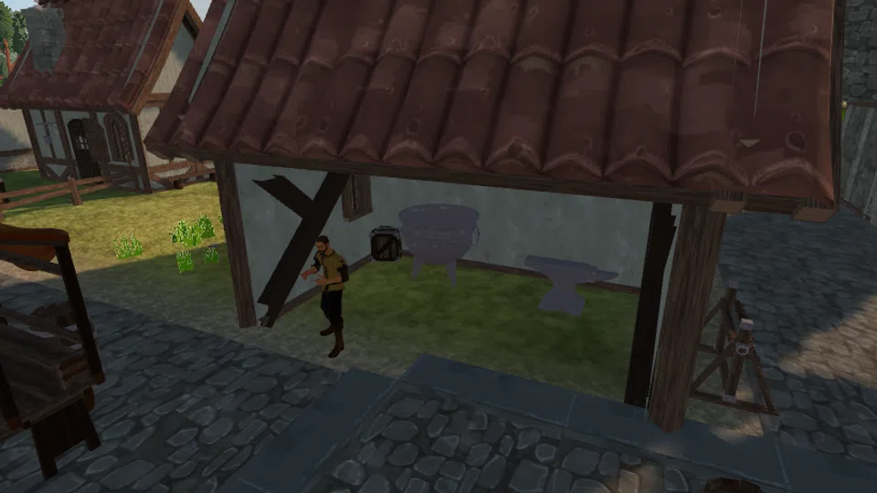

**Coldbrace Furnace**

#### 3. Smith a Grithe dagger at the Coldbrace Anvil.

The anvil stands four metres from the furnace. The dagger is the cheapest thing on it.

**Grithe Dagger**

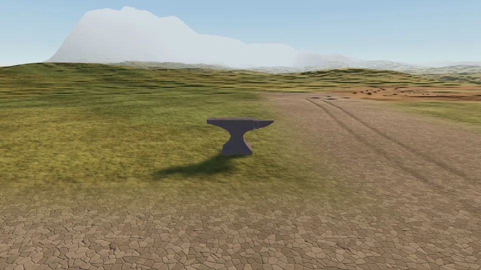

**Coldbrace Anvil**

#### 4. Equip the Grithe dagger and kill 3 Rill Skitterlings on the brook flats south-east of town.

`equipItem("grithe_dagger")` first - the stage checks the slot, not just the bag. The Rill Skitterlings are passive and sit around (-88, -70), between town and the shallows.

**Grithe Dagger**

**Rill Skitterling**

#### 5. Tell Harrow the Smith that the dagger held.

Walk back into Coldbrace Square and `interact("npc_smith_harrow", "talk")`.

**Harrow the Smith**

### Completion rewards

| Reward | Amount |
| --- | --- |
| Mining XP | 120 |
| Smithing XP | 140 |
| Melee XP | 60 |
| Grithe Hatchet | 1 |
| Seared Minnow | 5 |
| Marks | 150 |
| Unlock | Harrow will talk about the higher tiers. |
| Unlock | The rest of Coldbrace will give you work. |

## Dorn's Tally

The March Company ledger says a Grithe seam is worth four loads. Pitmaster Dorn has been signing that figure for nine years and has never once believed it. Work a seam to the bottom, count what it actually gave, and settle the argument with a number.

| Giver | Region | Requirements | Prerequisite |
| --- | --- | --- | --- |
| Pitmaster Dorn | Fallowmarch | None | None |

### Walkthrough

#### 1. Work one Grithe seam at the Bracken Pit until it is worked out. Stay on the same seam: Dorn wants the count from one node, not from six.

Pick one seam and stay on it. `inspect` the node while you work: its `resource.remaining` counts down, and the event that ends it carries `yieldsTaken`, which is the number Dorn wants.

**Bracken Pit**

**Grithe Ore**

**Stage reward**

| Reward | Amount |
| --- | --- |
| Mining XP | 40 |

#### 2. Tell Pitmaster Dorn how many loads the seam actually gave. He offers three bands; pick the one your seam fell into.

The exact figure was in the `resource.depleted` event, and the quest kept it: it is the `last_seam_yield` counter on this quest's record. Guess wrong and Dorn sends you back to check, which costs nothing but a walk.

**Pitmaster Dorn**

**Stage reward**

| Reward | Amount |
| --- | --- |
| Mining XP | 60 |

#### 3. Make the vault agree with the ledger: bank 15 Grithe ore at the Coldbrace Bank.

Walk to the bank counter and `bank("deposit", { itemId: "grithe_ore", quantity: -1 })`. The stage counts what is in the bank, not what you carried in.

**Grithe Ore**

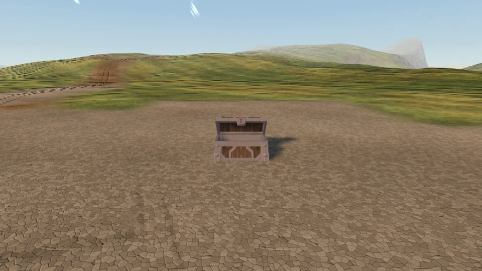

**Coldbrace Bank**

#### 4. Sign the corrected page with Pitmaster Dorn.

Back to the square. He will have a pen ready; he always has a pen ready.

**Pitmaster Dorn**

### Completion rewards

| Reward | Amount |
| --- | --- |
| Mining XP | 260 |
| Grithe Pickaxe | 1 |
| Marks | 220 |
| Unlock | Dorn will quote you real seam figures instead of the ledger's. |

## Bright Water

Ranger Syb has walked the march for eleven weeks and eaten cold things for eleven weeks. She has stopped complaining about it, which everyone agrees is worse.

| Giver | Region | Requirements | Prerequisite |
| --- | --- | --- | --- |
| Ranger Syb | Fallowmarch | None | None |

### Supplied when accepted

| Item | Amount |
| --- | --- |
| Bittergrain Seed | 4 |
| Unlock | Syb hands you four Bittergrain seeds. |

### Walkthrough

#### 1. Rake a plot at Marchfield, plant a Bittergrain seed, and harvest 3 Bittergrain.

Six plots sit inside the old wall line. `interact(<plot>, "rake")`, then `"plant"`, then wait for the plot to read `ready` and `"harvest"`. Bittergrain takes about four minutes of game time.

**Marchfield**

**Bittergrain**

**Stage reward**

| Reward | Amount |
| --- | --- |
| Farming XP | 45 |

#### 2. Catch 4 Silt Minnow at Redsill Shallows.

Four fishing spots on the red silt, 120 m east of town. `interact(<spot>, "fish")`. Fishing 1 is enough; a rod is not required, only slower without one.

**Silt Minnow**

**Redsill Shallows**

**Stage reward**

| Reward | Amount |
| --- | --- |
| Fishing XP | 45 |

#### 3. Cook 2 Seared Minnow at the Coldbrace Cooking Range.

At Cooking 1 nearly half of them burn. That is the rule, not bad luck - cook spares. Burnt Minnow does not count.

**Seared Minnow**

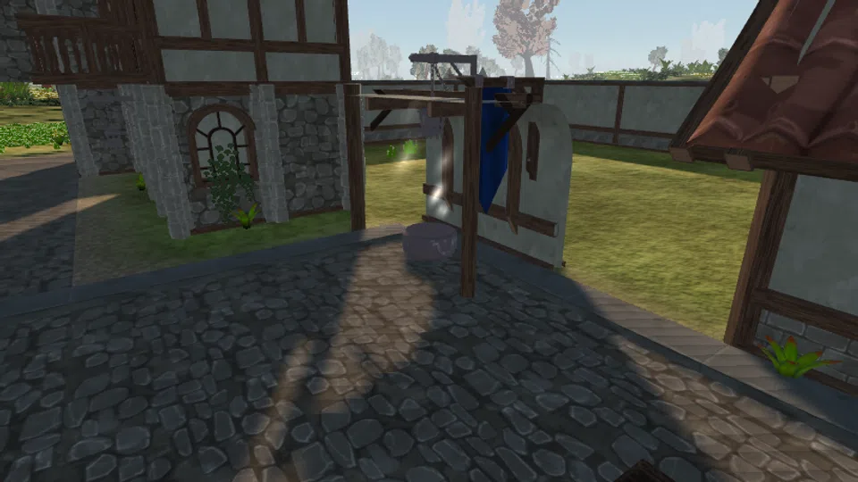

**Coldbrace Range**

**Stage reward**

| Reward | Amount |
| --- | --- |
| Cooking XP | 45 |

#### 4. Give Ranger Syb 2 Seared Minnow and 3 Bittergrain, and watch her eat a hot meal.

She is in Coldbrace Square. The handover takes the food out of your bag.

**Ranger Syb**

**Seared Minnow**

**Bittergrain**

### Completion rewards

| Reward | Amount |
| --- | --- |
| Farming XP | 90 |
| Fishing XP | 120 |
| Cooking XP | 120 |
| Palewood Rod | 1 |
| Bittergrain Seed | 6 |
| Marks | 180 |
| Unlock | Syb will tell you where the water is in every region she has walked. |

## The Carter's Wager

Carter Bel has bet Warden Ilse two weeks of cart duty that the pit road is slower than going over things. Warden Ilse has cited three regulations. Carter Bel has cited a cousin.

| Giver | Region | Requirements | Prerequisite |
| --- | --- | --- | --- |
| Carter Bel | Fallowmarch | None | None |

### Walkthrough

#### 1. Train Agility to level 3 on the Brookvault Planks - vault them until the skill comes up.

The planks cross Corven Brook at (-78, -30) and need Agility 1. Every successful vault pays Agility XP; a failure costs a few health and nothing else. `interact("brookvault_planks", "vault")`.

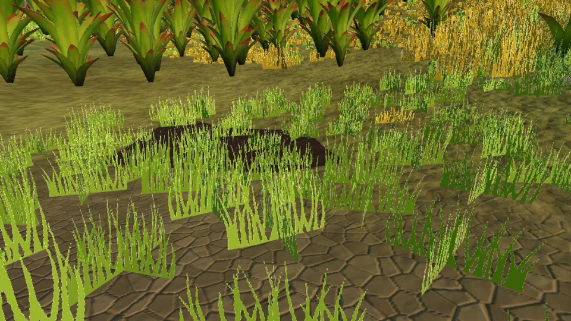

**Brookvault Planks**

**Stage reward**

| Reward | Amount |
| --- | --- |
| Agility XP | 30 |

#### 2. Vault the Coldbrace north wall at least once.

It sits on the town's north wall at (-160, -56) and needs Agility 3, which stage 1 just bought you. It saves 44 m on the run to the pit, which is Bel's entire argument.

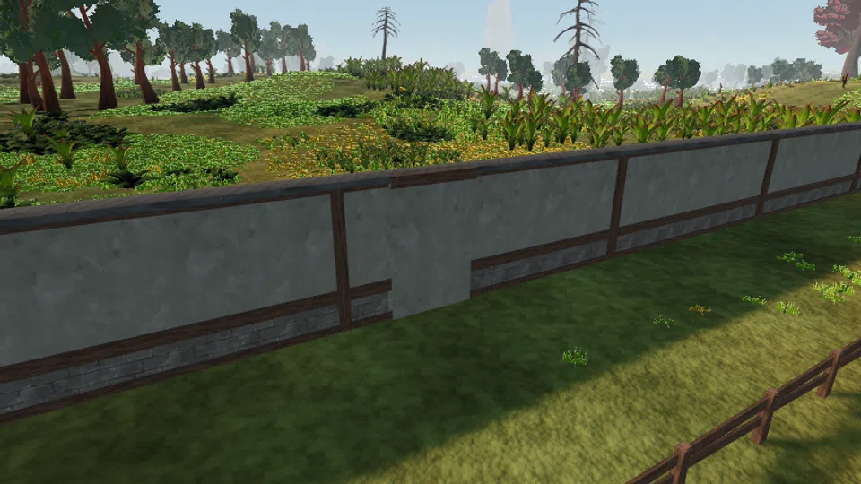

**Wall Vault**

**Stage reward**

| Reward | Amount |
| --- | --- |
| Agility XP | 60 |

#### 3. Report your time to Carter Bel at the south gate. He will believe whatever you say. Warden Ilse is standing directly behind him.

Every answer finishes the quest. Only one of them survives contact with the Warden, and the difference shows up in what those two say to you afterwards.

**Carter Bel**

### Completion rewards

| Reward | Amount |
| --- | --- |
| Agility XP | 180 |
| Seared Minnow | 4 |
| Marks | 260 |
| Unlock | Warden Ilse will tell you where every shortcut in Fallowmarch is. |
| Unlock | Carter Bel will tell you about a cousin. |

## Crooked Grain

Woodward Ansel will let you take eight Duskoak out of his stand. He would like you to understand, first, which one you are not taking.

| Giver | Region | Requirements | Prerequisite |
| --- | --- | --- | --- |
| Woodward Ansel | Vellenwood | Woodcutting 5 | None |

### Walkthrough

#### 1. Fell Duskoak at the Duskoak Stand until you hold 8 Duskoak logs.

Ten trees stand there and Woodcutting 5 is the gate. Logs do not stack, so eight logs is eight inventory slots - bank anything else first.

**Duskoak Stand**

**Duskoak Log**

**Stage reward**

| Reward | Amount |
| --- | --- |
| Woodcutting XP | 120 |

#### 2. Go and stand at the Split Duskoak, the one tree Ansel will not let anybody cut.

It is at (170, 112), east of Rootfall past the Blackwater Pools. `observe({ radius: 140, archetypes: ["landmark"] })` finds it, then `moveTo({ entityId: "split_duskoak" })`. `inspect` it when you get there; it is still alive on one side.

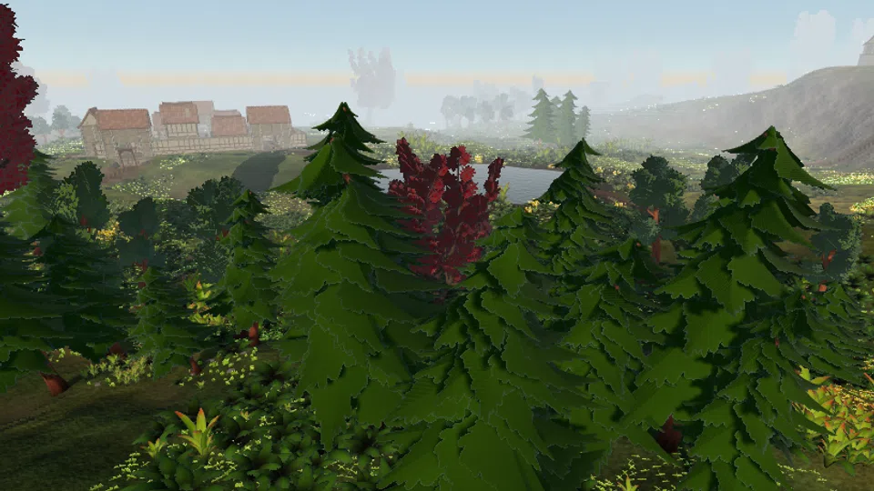

**Split Duskoak**

#### 3. Bring the 8 Duskoak logs back to Woodward Ansel in Rootfall and tell him what you saw.

The handover takes the logs. He counts them; he counts everything from this stand.

**Woodward Ansel**

**Duskoak Log**

### Completion rewards

| Reward | Amount |
| --- | --- |
| Woodcutting XP | 420 |
| Corven Hatchet | 1 |
| Marks | 400 |
| Unlock | Ansel will name the trees you are allowed to fell in the deep stand. |

## Knots and Names

Seamer Juno makes the parts of things: shafts, cord, hide, and the small bright shards that make a staff do anything at all. She will teach both trades to anyone who brings her the raw material and does not pretend to already know.

| Giver | Region | Requirements | Prerequisite |
| --- | --- | --- | --- |
| Seamer Juno | Vellenwood | None | None |

### Supplied when accepted

| Item | Amount |
| --- | --- |
| Pale Quartz | 3 |
| Unlock | Juno hands you three Pale Quartz to start on. |

### Walkthrough

#### 1. Fletch 4 Palewood shafts at a fletching bench.

Shafts come from Palewood logs, cut at the Palewood Copse in Fallowmarch (locationId `palewood_copse`). Coldbrace has the only fletching bench in Phase 1.

**Palewood Shaft**

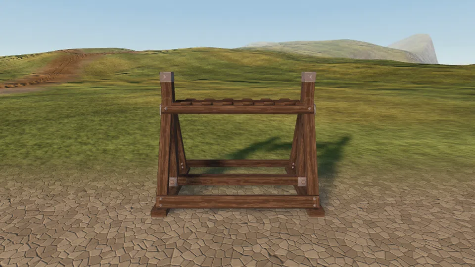

**Coldbrace Fletching**

**Stage reward**

| Reward | Amount |
| --- | --- |
| Fletching XP | 60 |

#### 2. Craft 5 Essence Shards at a crafting table.

Shards come off gems. Pale Quartz drops as a bonus while mining Grithe, and Juno already gave you three to be going on with. Shards stack, so this is one inventory slot.

**Essence Shard**

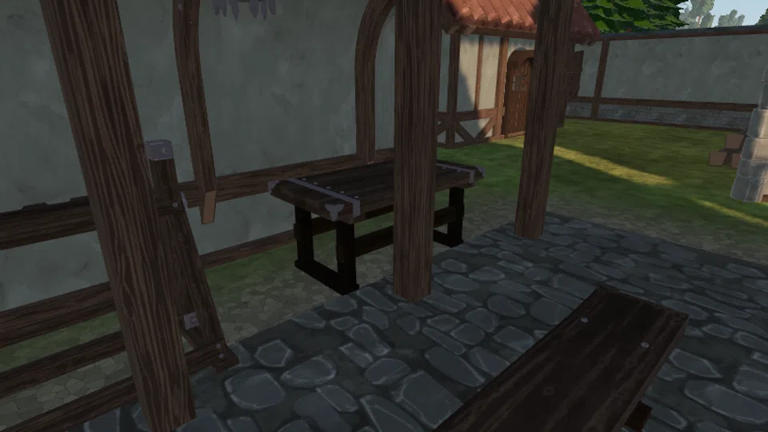

**Coldbrace Crafting**

**Stage reward**

| Reward | Amount |
| --- | --- |
| Crafting XP | 60 |

#### 3. Bring Seamer Juno the 4 shafts and 5 shards so she can show you what they are for.

She works the trade post side of the Rootfall stump. The handover takes both.

**Seamer Juno**

**Palewood Shaft**

**Essence Shard**

### Completion rewards

| Reward | Amount |
| --- | --- |
| Crafting XP | 240 |
| Fletching XP | 240 |
| Bramblehide Wraps | 1 |
| Essence Shard | 10 |
| Marks | 300 |
| Unlock | Juno will explain what an essence shard is actually doing inside a spell. |

## Eleven Empty Days

Trapper Mott has eleven traps in the deep wood. In eleven days they have caught eleven nothings. He would like a second opinion, and he would like it delivered gently.

| Giver | Region | Requirements | Prerequisite |
| --- | --- | --- | --- |
| Trapper Mott | Vellenwood | None | None |

### Walkthrough

#### 1. Walk Mott's trap line: the Blackwater Pools, the Gorge Head, the Thornline Camp and the Gorge Ford, in any order.

All four are route-graph nodes: `moveTo({ locationId })` reaches each one directly. The Thornline is where the Thornbound Husks keep to the edge, so go there with health to spare or take the long way round by the ford.

**Blackwater Pools**

**Gorge Head**

**The Thornline**

**Gorge Ford**

**Stage reward**

| Reward | Amount |
| --- | --- |
| Agility XP | 90 |

#### 2. Something has been going through the bait. Kill 3 Bramble Skitterlings between Rootfall and the Thornline.

They sit around (150, 128) and they are aggressive, so they will find you first.

**Bramble Skitterling**

**Stage reward**

| Reward | Amount |
| --- | --- |
| Melee XP | 150 |

#### 3. Report to Trapper Mott in Rootfall. Decide on the way whether to mention the thing you noticed about how his traps are set.

Both answers finish the quest. One of them changes what Mott says to you for the rest of the game, and it is not the kind one.

**Trapper Mott**

### Completion rewards

| Reward | Amount |
| --- | --- |
| Melee XP | 200 |
| Agility XP | 120 |
| Seared Trout | 5 |
| Marks | 420 |
| Unlock | Mott will tell you what is moving in the deep wood, at length, whether you ask or not. |

## Bad Ground

Foreman Arden has a crew that stopped digging and a camp that still has to eat. He wants sixteen Kaldite in the Highcairn vault and he wants to know which way you walked to get it.

| Giver | Region | Requirements | Prerequisite |
| --- | --- | --- | --- |
| Foreman Arden | Karrowmoor | Mining 10, Agility 10 | None |

### Walkthrough

#### 1. Mine 10 Kaldite ore at the Lower Quarry.

Five Kaldite faces on terrace one, next to the Gravelmaw mouth. Mining 10 is the gate. Ore does not stack: ten ore is ten slots.

**Kaldite Ore**

**Lower Quarry**

**Stage reward**

| Reward | Amount |
| --- | --- |
| Mining XP | 150 |

#### 2. Climb Sunder Ledge at least once.

It runs from the Highcairn bank at (170, -74) up to the Upper Karrow Seam and needs Agility 10. By road that trip is 188 m; over the ledge it is 46 m plus a six-second climb. Compare `moveTo` path lengths before and after if you want to see the flip.

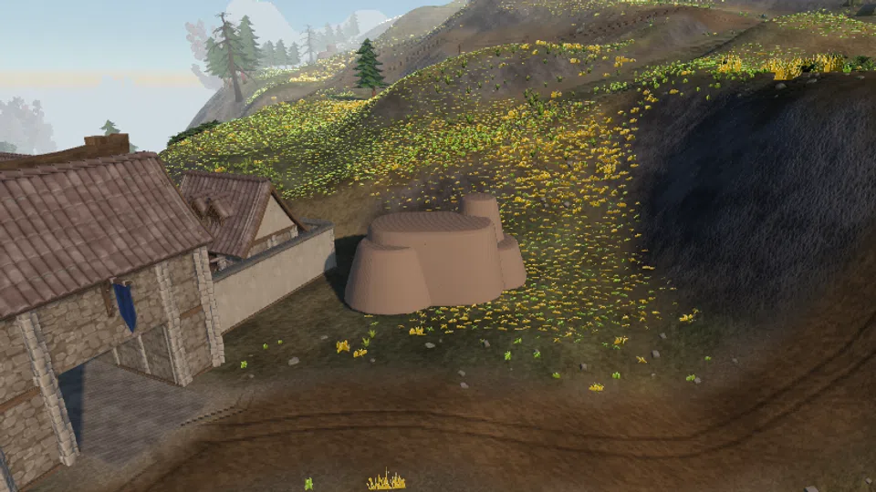

**Sunder Ledge**

**Stage reward**

| Reward | Amount |
| --- | --- |
| Agility XP | 120 |

#### 3. Put 16 Kaldite ore into the Highcairn Bank.

The Upper Karrow Seam is only three nodes and genuinely runs dry above Mining 20 - the Lower Quarry is the reliable half of the circuit. The stage counts the bank, not the bag.

**Kaldite Ore**

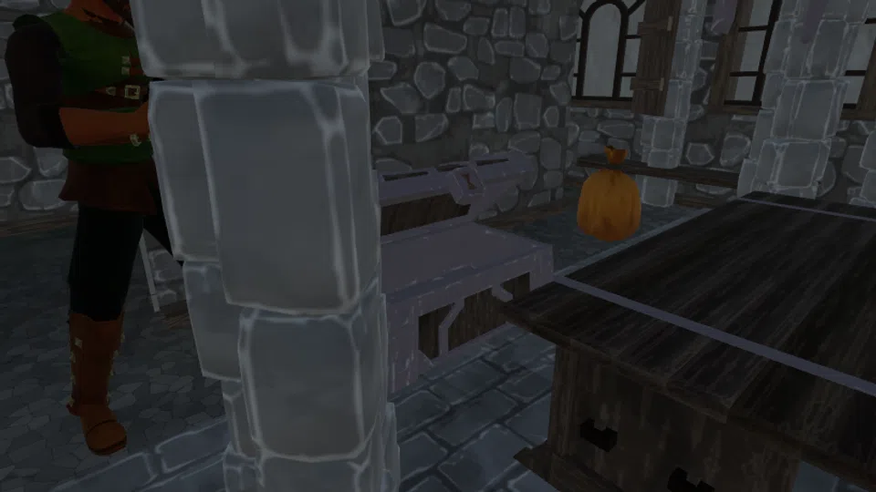

**Highcairn Bank Counter**

#### 4. Tell Foreman Arden which route you used.

He is at the middle of the camp. He will have the figure already; he always does.

**Foreman Arden**

### Completion rewards

| Reward | Amount |
| --- | --- |
| Mining XP | 900 |
| Agility XP | 400 |
| Kaldite Pickaxe | 1 |
| Marks | 900 |
| Unlock | Arden will quote you the real distance between any two things on the moor. |

## The Sparking Stone

Quarrier Vess has been cutting Kaldite for nine years and she has never liked what it does in the dark. She would like somebody who is not her to find out what is in it.

| Giver | Region | Requirements | Prerequisite |
| --- | --- | --- | --- |
| Quarrier Vess | Karrowmoor | Mining 10 | None |

### Supplied when accepted

| Item | Amount |
| --- | --- |
| Palewood Staff | 1 |
| Essence Shard | 12 |
| Unlock | Vess lends you her brother's old staff and a dozen shards. |

### Walkthrough

#### 1. Equip the staff Vess lent you.

`equipItem("palewood_staff")`. A staff in the main hand is what lets `cast` resolve at all; the shards are the ammunition.

**Palewood Staff**

#### 2. Raise Magic to level 5 by casting Emberlash at something that will hold still for it.

Every cast eats one Essence Shard and pays Magic XP for the damage. Skitterlings on the moor around (170, -160) are the cheap target; Cairnwights are not. Craft more shards at a crafting table if you run out - gems drop while mining.

**Spell:** Emberlash

**Stage reward**

| Reward | Amount |
| --- | --- |
| Magic XP | 60 |

#### 3. Bring Quarrier Vess 6 Kaldite ore so she can watch what a live spell does to it.

She is at the middle of Highcairn. The handover takes the ore.

**Quarrier Vess**

**Kaldite Ore**

### Completion rewards

| Reward | Amount |
| --- | --- |
| Magic XP | 700 |
| Mining XP | 200 |
| Amber Focus | 1 |
| Essence Shard | 25 |
| Marks | 700 |
| Unlock | Vess stops calling the Kaldite "that" and starts calling it by its name. |

## The Long Cairn

Somebody has been re-stacking the cairns on Karrowmoor. Cairnkeeper Ode knows every stone on this moor by name and she did not move them. The line of re-stacked cairns runs from terrace four down the ramps and into a hole the quarry crew stopped digging six months ago.

| Giver | Region | Requirements | Prerequisite |
| --- | --- | --- | --- |
| Cairnkeeper Ode | Karrowmoor | Melee 10, Mining 10 | None |

### Walkthrough

#### 1. Go and look at the Great Cairn on terrace four.

`moveTo({ locationId: "great_cairn" })` from Highcairn goes bank -> Second Ramp -> Third Ramp -> the cairn. Cairnwights hold the ground around (100, -110) on the way, so travel fed and armed. `inspect("great_cairn_stone")` when you arrive.

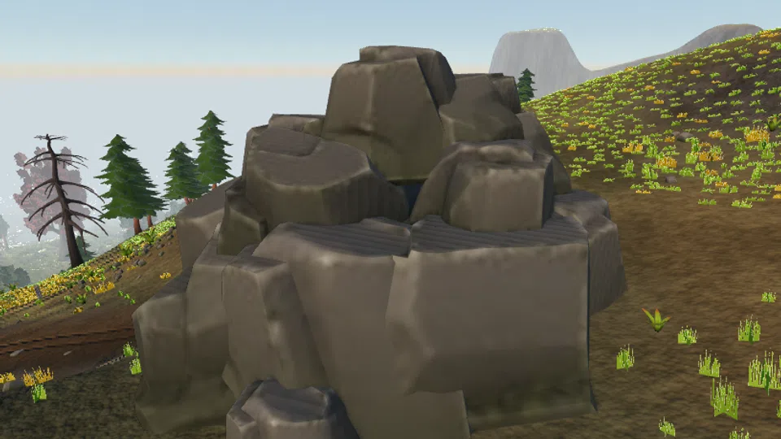

**Great Cairn Stone**

**The Great Cairn**

**Stage reward**

| Reward | Amount |
| --- | --- |
| Mining XP | 120 |

#### 2. Tell Cairnkeeper Ode at Highcairn that the Great Cairn has been re-stacked.

She stands on the west side of the camp, at (138, -68).

**Cairnkeeper Ode**

**Stage reward**

| Reward | Amount |
| --- | --- |
| Melee XP | 120 |
| Marks | 150 |

#### 3. Ask Watcher Hale what the rota has seen come out of the Gravelmaw.

Hale is at (152, -74), the east side of Highcairn. He watches the mouth for a living and he will tell you what is in the first chamber if you ask him directly.

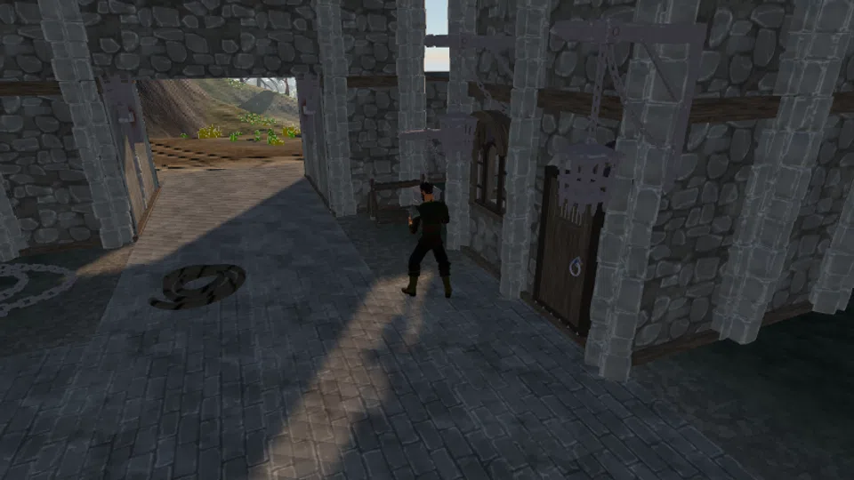

**Watcher Hale**

**Stage reward**

| Reward | Amount |
| --- | --- |
| Magic XP | 90 |

#### 4. Enter the Gravelmaw, kill 4 Cairnwights in the Lit Gallery, and reach The Collapse.

The mouth is at (46, -24) on terrace one, next to the Lower Quarry. Inside, `moveTo({ locationId: "gravelmaw_chamber1" })` then `"gravelmaw_chamber2"`. The gallery is lit; the collapse is not.

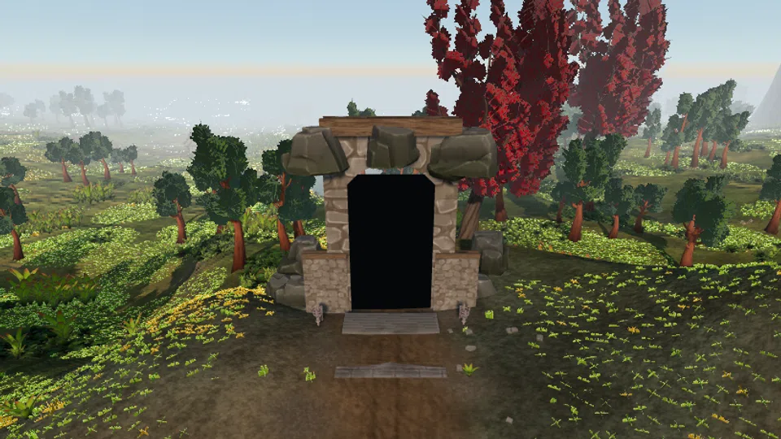

**Gravelmaw Mouth Portal**

**Cairnwight**

**The Collapse**

**Stage reward**

| Reward | Amount |
| --- | --- |
| Melee XP | 400 |

#### 5. Ask Cairnkeeper Ode about the three levers, work out the order she describes, then open the Three-Lever Door in The Collapse.

Ode describes all three mason's marks and the crew's rule for ordering them on her `ode_long_cairn_levers` node; the answer is in what she says, not in anything you have to see. Get it right and the door unbars, at which point `interact("gravelmaw_stone_door", "open")` inside chamber 2 swings it. Get it wrong twice and she will simply tell you.

**Cairnkeeper Ode**

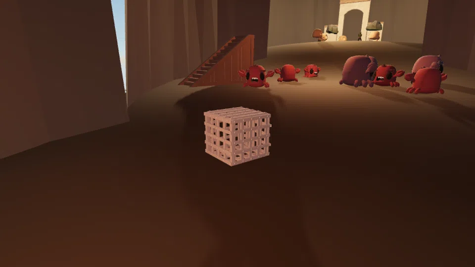

**Gravelmaw Stone Door**

**Stage reward**

| Reward | Amount |
| --- | --- |
| Agility XP | 200 |
| Mining XP | 200 |
| Unlock | The Collapse now walks straight through into The Cairn Hall. |

#### 6. Go back to Cairnkeeper Ode and ask for the keeping-stone she means to leave in the hall.

She will hand you a Cairn Garnet (item `cairn_garnet`). Do not sell it; stage 7 checks that you are still carrying it.

**Cairnkeeper Ode**

**Stage reward**

| Reward | Amount |
| --- | --- |
| Cairn Garnet | 1 |
| Marks | 300 |

#### 7. Carry the Cairn Garnet into The Cairn Hall, kill the 2 Thornbound Elders standing over the cairn, and set the stone on it.

With the door open, chamber 2 walks straight through to chamber 3. The stage completes the moment all three hold at once: both Elders dead, you inside the hall, garnet still in your bag. Completing it takes the garnet and unseals the Quarrykeeper's Gate.

**Cairn Garnet**

**The Cairn Hall**

**Thornbound Elder**

### Completion rewards

| Reward | Amount |
| --- | --- |
| Melee XP | 1600 |
| Magic XP | 600 |
| Mining XP | 600 |
| Agility XP | 300 |
| Kaldite Dagger | 1 |
| Seared Cragfin | 8 |
| Marks | 2400 |
| Unlock | The Quarrykeeper's Gate (entity `ordrun_gate`) is unsealed. Ordrun is behind it. |
| Unlock | Cairnkeeper Ode will speak plainly about what is under the Great Cairn. |
