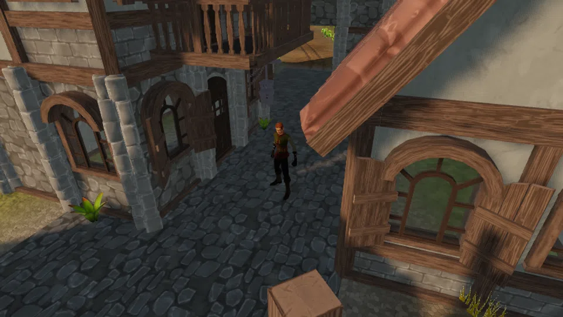

Ranger Syb has walked the march for eleven weeks and eaten cold things for eleven weeks. She has stopped complaining about it, which everyone agrees is worse.

| Giver | Start location | Region | Requirements | Prerequisite |
| --- | --- | --- | --- | --- |
| [Ranger Syb](../../npcs/#ranger-syb) | [Coldbrace Square](../../regions/#coldbrace-square) | [Fallowmarch](../../regions/#fallowmarch) | None | None |

## Supplied when accepted

| Item | Amount |
| --- | --- |
| [Bittergrain Seed](../../items/#bittergrain-seed) | 4 |
| Unlock | Syb hands you four Bittergrain seeds. |

## Walkthrough

### 1. Rake a plot at Marchfield, plant a Bittergrain seed, and harvest 3 Bittergrain.

Six plots sit inside the old wall line. `interact(<plot>, "rake")`, then `"plant"`, then wait for the plot to read `ready` and `"harvest"`. Bittergrain takes about four minutes of game time.

<nav class="corealm-quest-where" aria-label="Locations for step 1">Where<a href="../../regions/#marchfield">Marchfield</a></nav>
<nav class="corealm-quest-items" aria-label="Items for step 1">Items<a href="../../items/#bittergrain">Bittergrain</a></nav>

<figure class="corealm-quest-scene"><figcaption><strong>Marchfield</strong>Marchfield, Fallowmarch</figcaption></figure>

<figure class="corealm-location-map corealm-quest-map" data-location-map style="--map-image-ratio:1.3333333333333333">

<a class="corealm-map-marker" href="../../regions/#marchfield" style="--map-x:42.0000%;--map-y:51.8333%" data-map-side="right" data-map-kind="farm" data-map-marker aria-label="Marchfield, Fallowmarch" title="Marchfield, Fallowmarch">Marchfield<small>Fallowmarch</small></a>

N

<button type="button" data-map-action="out" aria-label="Zoom out" title="Zoom out">&minus;</button>
<button type="button" data-map-action="reset" aria-label="Reset map" title="Reset map">&#x25CE;</button>
<button type="button" data-map-action="in" aria-label="Zoom in" title="Zoom in">+</button>

<button class="corealm-map-expand" type="button" data-map-action="expand" aria-label="Expand map" aria-pressed="false" title="Expand map">&#x26F6;</button>

<figcaption>Marchfield.</figcaption>
</figure>

#### Stage reward

| Reward | Amount |
| --- | --- |
| Farming XP | 45 |

### 2. Catch 4 Silt Minnow at Redsill Shallows.

Four fishing spots on the red silt, 120 m east of town. `interact(<spot>, "fish")`. Fishing 1 is enough; a rod is not required, only slower without one.

<nav class="corealm-quest-where" aria-label="Locations for step 2">Where<a href="../../regions/#redsill-shallows">Redsill Shallows</a></nav>
<nav class="corealm-quest-items" aria-label="Items for step 2">Items<a href="../../items/#silt-minnow">Silt Minnow</a></nav>

<figure class="corealm-quest-scene"><figcaption><strong>Redsill Shallows</strong>Redsill Shallows, Fallowmarch</figcaption></figure>

<figure class="corealm-location-map corealm-quest-map" data-location-map style="--map-image-ratio:1.3333333333333333">

<a class="corealm-map-marker" href="../../regions/#redsill-shallows" style="--map-x:46.6667%;--map-y:55.0000%" data-map-side="right" data-map-kind="water" data-map-marker aria-label="Redsill Shallows, Fallowmarch" title="Redsill Shallows, Fallowmarch">Redsill Shallows<small>Fallowmarch</small></a>

N

<button type="button" data-map-action="out" aria-label="Zoom out" title="Zoom out">&minus;</button>
<button type="button" data-map-action="reset" aria-label="Reset map" title="Reset map">&#x25CE;</button>
<button type="button" data-map-action="in" aria-label="Zoom in" title="Zoom in">+</button>

<button class="corealm-map-expand" type="button" data-map-action="expand" aria-label="Expand map" aria-pressed="false" title="Expand map">&#x26F6;</button>

<figcaption>Redsill Shallows.</figcaption>
</figure>

#### Stage reward

| Reward | Amount |
| --- | --- |
| Fishing XP | 45 |

### 3. Cook 2 Seared Minnow at the Coldbrace Cooking Range.

At Cooking 1 nearly half of them burn. That is the rule, not bad luck - cook spares. Burnt Minnow does not count.

<nav class="corealm-quest-where" aria-label="Locations for step 3">Where<a href="../../regions/#coldbrace-square">Coldbrace Square</a></nav>
<nav class="corealm-quest-items" aria-label="Items for step 3">Items<a href="../../items/#seared-minnow">Seared Minnow</a></nav>

<figure class="corealm-quest-scene"><figcaption><strong>Coldbrace Cooking Range</strong>Coldbrace Square, Fallowmarch</figcaption></figure>

<figure class="corealm-location-map corealm-quest-map" data-location-map style="--map-image-ratio:1.3333333333333333">

<a class="corealm-map-marker" href="../../regions/#coldbrace-square" style="--map-x:37.5833%;--map-y:56.0250%" data-map-side="right" data-map-kind="entity" data-map-marker aria-label="Coldbrace Cooking Range, Fallowmarch" title="Coldbrace Cooking Range, Fallowmarch">Coldbrace Cooking Range<small>Fallowmarch</small></a>

N

<button type="button" data-map-action="out" aria-label="Zoom out" title="Zoom out">&minus;</button>
<button type="button" data-map-action="reset" aria-label="Reset map" title="Reset map">&#x25CE;</button>
<button type="button" data-map-action="in" aria-label="Zoom in" title="Zoom in">+</button>

<button class="corealm-map-expand" type="button" data-map-action="expand" aria-label="Expand map" aria-pressed="false" title="Expand map">&#x26F6;</button>

<figcaption>Coldbrace Square.</figcaption>
</figure>

#### Stage reward

| Reward | Amount |
| --- | --- |
| Cooking XP | 45 |

### 4. Give Ranger Syb 2 Seared Minnow and 3 Bittergrain, and watch her eat a hot meal.

She is in Coldbrace Square. The handover takes the food out of your bag.

<nav class="corealm-quest-where" aria-label="Locations for step 4">Where<a href="../../regions/#coldbrace-square">Coldbrace Square</a></nav>
<nav class="corealm-quest-items" aria-label="Items for step 4">Items<a href="../../items/#seared-minnow">Seared Minnow</a><a href="../../items/#bittergrain">Bittergrain</a></nav>

<figure class="corealm-quest-scene"><figcaption><strong>Ranger Syb</strong>Coldbrace Square, Fallowmarch</figcaption></figure>

<figure class="corealm-location-map corealm-quest-map" data-location-map style="--map-image-ratio:1.3333333333333333">

<a class="corealm-map-marker" href="../../npcs/#ranger-syb" style="--map-x:35.2500%;--map-y:56.1833%" data-map-side="right" data-map-kind="npc" data-map-marker aria-label="Ranger Syb, Fallowmarch" title="Ranger Syb, Fallowmarch">Ranger Syb<small>Fallowmarch</small></a>

N

<button type="button" data-map-action="out" aria-label="Zoom out" title="Zoom out">&minus;</button>
<button type="button" data-map-action="reset" aria-label="Reset map" title="Reset map">&#x25CE;</button>
<button type="button" data-map-action="in" aria-label="Zoom in" title="Zoom in">+</button>

<button class="corealm-map-expand" type="button" data-map-action="expand" aria-label="Expand map" aria-pressed="false" title="Expand map">&#x26F6;</button>

<figcaption>Coldbrace Square.</figcaption>
</figure>

## Completion rewards

| Reward | Amount |
| --- | --- |
| Farming XP | 90 |
| Fishing XP | 120 |
| Cooking XP | 120 |
| [Palewood Rod](../../items/#palewood-rod) | 1 |
| [Bittergrain Seed](../../items/#bittergrain-seed) | 6 |
| Marks | 180 |
| Unlock | Syb will tell you where the water is in every region she has walked. |
