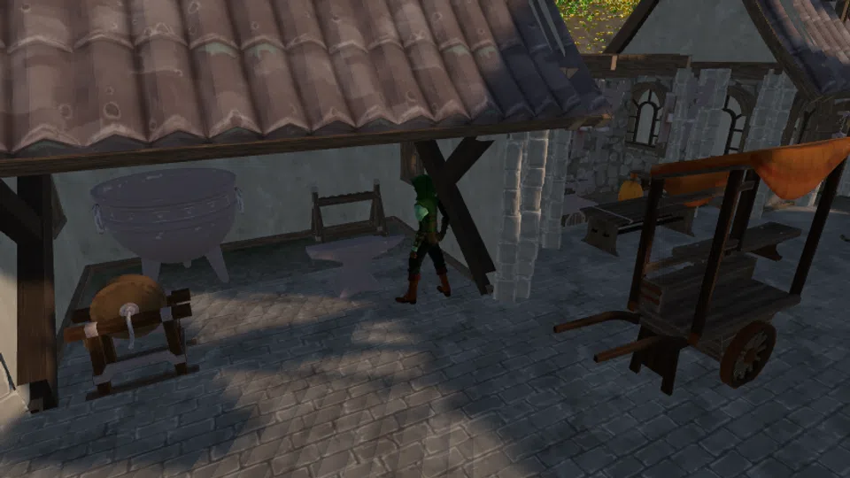

Quarrier Vess has been cutting Kaldite for nine years and she has never liked what it does in the dark. She would like somebody who is not her to find out what is in it.

| Giver | Start location | Region | Requirements | Prerequisite |
| --- | --- | --- | --- | --- |
| [Quarrier Vess](../../npcs/#quarrier-vess) | [Highcairn](../../regions/#highcairn) | [Karrowmoor](../../regions/#karrowmoor) | Mining 10 | None |

## Supplied when accepted

| Item | Amount |
| --- | --- |
| [Palewood Staff](../../items/#palewood-staff) | 1 |
| [Essence Shard](../../items/#essence-shard) | 12 |
| Unlock | Vess lends you her brother's old staff and a dozen shards. |

## Walkthrough

### 1. Equip the staff Vess lent you.

`equipItem("palewood_staff")`. A staff in the main hand is what lets `cast` resolve at all; the shards are the ammunition.

<nav class="corealm-quest-where" aria-label="Locations for step 1">Where<a href="../../regions/#highcairn">Highcairn</a></nav>
<nav class="corealm-quest-items" aria-label="Items for step 1">Items<a href="../../items/#palewood-staff">Palewood Staff</a></nav>

<figure class="corealm-quest-scene"><figcaption><strong>Highcairn</strong>Highcairn</figcaption></figure>

<figure class="corealm-location-map corealm-quest-map" data-location-map style="--map-image-ratio:1.3333333333333333">

<a class="corealm-map-marker" href="../../regions/#highcairn" style="--map-x:62.0000%;--map-y:55.5000%" data-map-side="right" data-map-kind="settlement" data-map-marker aria-label="Highcairn, Karrowmoor" title="Highcairn, Karrowmoor">Highcairn<small>Karrowmoor</small></a>

N

<button type="button" data-map-action="out" aria-label="Zoom out" title="Zoom out">&minus;</button>
<button type="button" data-map-action="reset" aria-label="Reset map" title="Reset map">&#x25CE;</button>
<button type="button" data-map-action="in" aria-label="Zoom in" title="Zoom in">+</button>

<button class="corealm-map-expand" type="button" data-map-action="expand" aria-label="Expand map" aria-pressed="false" title="Expand map">&#x26F6;</button>

<figcaption>Highcairn.</figcaption>
</figure>

### 2. Raise Magic to level 5 by casting Emberlash at something that will hold still for it.

Every cast eats one Essence Shard and pays Magic XP for the damage. Skitterlings on the moor around (170, -160) are the cheap target; Cairnwights are not. Craft more shards at a crafting table if you run out - gems drop while mining.

<nav class="corealm-quest-where" aria-label="Locations for step 2">Where<a href="../../regions/#the-great-cairn">The Great Cairn</a><a href="../../regions/#upper-karrow-seam">Upper Karrow Seam</a></nav>

<figure class="corealm-quest-scene"><figcaption><strong>Scree Skitterling</strong>The Great Cairn, Upper Karrow Seam</figcaption></figure>

<figure class="corealm-location-map corealm-quest-map" data-location-map style="--map-image-ratio:1.3333333333333333">

<a class="corealm-map-marker" href="../../creatures/skitterling_t10/" style="--map-x:64.1667%;--map-y:63.3333%" data-map-side="left" data-map-kind="enemy" data-map-marker aria-label="Scree Skitterling, Karrowmoor" title="Scree Skitterling, Karrowmoor">Scree Skitterling<small>Karrowmoor</small></a>
<a class="corealm-map-marker" href="../../regions/#the-great-cairn" style="--map-x:61.6667%;--map-y:64.6667%" data-map-side="right" data-map-kind="landmark" data-map-marker aria-label="The Great Cairn, Karrowmoor" title="The Great Cairn, Karrowmoor">The Great Cairn<small>Karrowmoor</small></a>
<a class="corealm-map-marker" href="../../regions/#upper-karrow-seam" style="--map-x:66.1667%;--map-y:61.0000%" data-map-side="left" data-map-kind="seam" data-map-marker aria-label="Upper Karrow Seam, Karrowmoor" title="Upper Karrow Seam, Karrowmoor">Upper Karrow Seam<small>Karrowmoor</small></a>

N

<button type="button" data-map-action="out" aria-label="Zoom out" title="Zoom out">&minus;</button>
<button type="button" data-map-action="reset" aria-label="Reset map" title="Reset map">&#x25CE;</button>
<button type="button" data-map-action="in" aria-label="Zoom in" title="Zoom in">+</button>

<button class="corealm-map-expand" type="button" data-map-action="expand" aria-label="Expand map" aria-pressed="false" title="Expand map">&#x26F6;</button>

<figcaption>The Great Cairn, Upper Karrow Seam.</figcaption>
</figure>

#### Stage reward

| Reward | Amount |
| --- | --- |
| Magic XP | 60 |

### 3. Bring Quarrier Vess 6 Kaldite ore so she can watch what a live spell does to it.

She is at the middle of Highcairn. The handover takes the ore.

<nav class="corealm-quest-where" aria-label="Locations for step 3">Where<a href="../../regions/#highcairn">Highcairn</a></nav>
<nav class="corealm-quest-items" aria-label="Items for step 3">Items<a href="../../items/#kaldite-ore">Kaldite Ore</a></nav>

<figure class="corealm-quest-scene"><figcaption><strong>Quarrier Vess</strong>Highcairn</figcaption></figure>

<figure class="corealm-location-map corealm-quest-map" data-location-map style="--map-image-ratio:1.3333333333333333">

<a class="corealm-map-marker" href="../../npcs/#quarrier-vess" style="--map-x:62.1500%;--map-y:55.7000%" data-map-side="left" data-map-kind="npc" data-map-marker aria-label="Quarrier Vess, Karrowmoor" title="Quarrier Vess, Karrowmoor">Quarrier Vess<small>Karrowmoor</small></a>

N

<button type="button" data-map-action="out" aria-label="Zoom out" title="Zoom out">&minus;</button>
<button type="button" data-map-action="reset" aria-label="Reset map" title="Reset map">&#x25CE;</button>
<button type="button" data-map-action="in" aria-label="Zoom in" title="Zoom in">+</button>

<button class="corealm-map-expand" type="button" data-map-action="expand" aria-label="Expand map" aria-pressed="false" title="Expand map">&#x26F6;</button>

<figcaption>Highcairn.</figcaption>
</figure>

## Completion rewards

| Reward | Amount |
| --- | --- |
| Magic XP | 700 |
| Mining XP | 200 |
| [Amber Focus](../../items/#amber-focus) | 1 |
| [Essence Shard](../../items/#essence-shard) | 25 |
| Marks | 700 |
| Unlock | Vess stops calling the Kaldite "that" and starts calling it by its name. |
