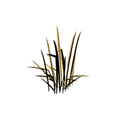
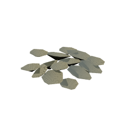

| Node | Skill | Tier | Level | Yields | XP each | Per node | Respawn |
| --- | --- | --- | --- | --- | --- | --- | --- |
| Marchfield Plot | Farming | 1 | 1 |  Bittergrain | 10 | 8-15 | 21 s |
| Redsill Shallow | Fishing | 1 | 1 |  Silt Minnow | 10 | 8-15 | 21 s |
| Grithe Seam | Mining | 1 | 1 |  Grithe Ore | 10 | 8-15 | 21 s |
| Marchstone Face | Mining | 1 | 1 |  March Stone | 10 | 8-15 | 21 s |
| Palewood | Woodcutting | 1 | 1 |  Palewood Log | 10 | 8-15 | 21 s |
| Blackwater Pool | Fishing | 5 | 5 |  Bramble Trout | 24 | 8-15 | 32 s |
| Corven Seam | Mining | 5 | 5 |  Corven Ore | 24 | 8-15 | 32 s |
| Duskoak | Woodcutting | 5 | 5 |  Duskoak Log | 24 | 8-15 | 32 s |
| Highcairn Plot | Farming | 10 | 10 |  Cairnleaf | 35 | 8-14 | 43 s |
| Cairn Tarn | Fishing | 10 | 10 |  Cragfin | 35 | 8-14 | 43 s |
| Kaldite Face | Mining | 10 | 10 |  Kaldite Ore | 35 | 8-14 | 43 s |
| Cairnpine | Woodcutting | 10 | 10 |  Cairnpine Log | 35 | 8-14 | 43 s |
